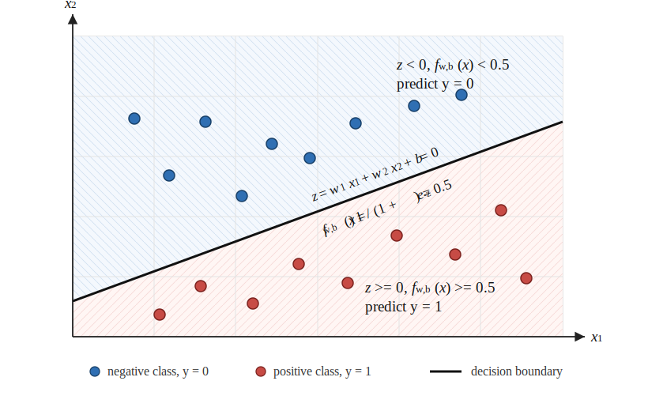

# 逻辑回归模型

逻辑回归是监督学习中的基础分类算法，用输入特征预测某个类别发生的概率。参考吴恩达《Machine Learning Specialization》中对逻辑回归的讲解，学习逻辑回归时需要把问题拆成五件事：分类问题、模型表示、代价函数、参数学习和决策边界。

## 1. 分类问题

分类任务的目标是学习输入 $\mathbf{x}$ 到离散类别 $y$ 的映射关系，例如：

- 根据肿瘤特征判断是否为恶性
- 根据邮件内容判断是否为垃圾邮件
- 根据交易特征判断是否存在欺诈

二分类问题中，标签通常写作：

$$
y \in \{0, 1\}
$$

其中，$1$ 表示正类，$0$ 表示负类。

训练集通常表示为：

$$
\{(\mathbf{x}^{(1)}, y^{(1)}), (\mathbf{x}^{(2)}, y^{(2)}), \cdots, (\mathbf{x}^{(m)}, y^{(m)})\}
$$

其中，$m$ 表示样本数量，$\mathbf{x}^{(i)}$ 表示第 $i$ 个样本的输入特征，$y^{(i)}$ 表示第 $i$ 个样本的真实类别。

## 2. 模型形式

线性回归输出范围不受限制，不能直接表示概率。逻辑回归先计算线性组合：

$$
z = \mathbf{w} \cdot \mathbf{x} + b
$$

再通过 Sigmoid 函数把 $z$ 映射到 $(0, 1)$ 区间：

$$
g(z) = \frac{1}{1 + e^{-z}}
$$

逻辑回归的假设函数为：

$$
f_{\mathbf{w},b}(\mathbf{x}) = g(\mathbf{w} \cdot \mathbf{x} + b)
$$

输出值可以解释为：

$$
f_{\mathbf{w},b}(\mathbf{x}) = P(y = 1 \mid \mathbf{x}; \mathbf{w}, b)
$$

即在给定输入特征和模型参数时，样本属于正类的概率。

## 3. 决策规则

逻辑回归输出的是概率，最终类别需要通过阈值转换。常用阈值为 $0.5$：

$$
\hat{y} =
\begin{cases}
1, & f_{\mathbf{w},b}(\mathbf{x}) \ge 0.5 \\
0, & f_{\mathbf{w},b}(\mathbf{x}) < 0.5
\end{cases}
$$

由于 Sigmoid 函数在 $z = 0$ 时输出 $0.5$，所以上述规则等价于：

$$
\mathbf{w} \cdot \mathbf{x} + b \ge 0 \Rightarrow \hat{y} = 1
$$

$$
\mathbf{w} \cdot \mathbf{x} + b < 0 \Rightarrow \hat{y} = 0
$$

## 4. 决策边界

决策边界是模型把样本划分为不同类别的分界线或分界面。在线性逻辑回归中，决策边界满足：

$$
\mathbf{w} \cdot \mathbf{x} + b = 0
$$

例如有两个特征 $x_1$ 和 $x_2$ 时：

$$
w_1x_1 + w_2x_2 + b = 0
$$



这是一条直线。通过构造多项式特征，逻辑回归也可以形成非线性决策边界，例如把 $x_1^2$、$x_2^2$、$x_1x_2$ 作为新特征。

## 5. 代价函数

线性回归的平方误差代价函数用于逻辑回归时会形成非凸优化问题，课程中逻辑回归使用交叉熵损失。理解交叉熵损失，需要先从对数似然函数开始。

对单个样本 $\mathbf{x}$，逻辑回归输出：

$$
\hat y = f_{\mathbf{w},b}(\mathbf{x})
$$

其中，$\hat y$ 表示样本属于正类 $y=1$ 的概率：

$$
P(y=1|\mathbf{x})=\hat y
$$

$$
P(y=0|\mathbf{x})=1-\hat y
$$

二分类标签只有 $0$ 和 $1$ 两种取值，因此真实标签出现的概率可以统一写成：

$$
P(y|\mathbf{x})=\hat y^y(1-\hat y)^{1-y}
$$

当 $y=1$ 时：

$$
P(y|\mathbf{x})=\hat y^1(1-\hat y)^0=\hat y
$$

这正好对应 $P(y=1|\mathbf{x})=\hat y$。

当 $y=0$ 时：

$$
P(y|\mathbf{x})=\hat y^0(1-\hat y)^1=1-\hat y
$$

这正好对应 $P(y=0|\mathbf{x})=1-\hat y$。

所以 $\hat y^y(1-\hat y)^{1-y}$ 的作用，是根据真实标签 $y$ 自动选择模型分配给真实类别的概率。

对真实标签概率取对数，可以得到单个样本的对数似然函数：

$$
\log P(y|\mathbf{x})
=
\log\left(\hat y^y(1-\hat y)^{1-y}\right)
$$

根据 $\log(ab)=\log a+\log b$ 和 $\log(a^c)=c\log a$：

$$
\log P(y|\mathbf{x})
=
y\log(\hat y)+(1-y)\log(1-\hat y)
$$

这个式子叫“对数似然函数”，因为它衡量的是：在当前参数 $\mathbf{w},b$ 下，模型让真实标签 $y$ 出现的概率有多大。训练数据中的标签是真实结果，训练逻辑回归就是要让这些真实结果在模型下具有更高概率；如果真实标签是 $1$，模型应增大 $\hat y$，如果真实标签是 $0$，模型应增大 $1-\hat y$。因此，训练目标可以写成最大化对数似然函数。

实际优化时通常把“最大化对数似然”改写成“最小化负对数似然”，因为机器学习训练过程通常按最小化损失函数来表达。对单个样本取负号后得到逻辑回归损失函数：

$$
L(\hat y,y)
=
-y\log(\hat y)-(1-y)\log(1-\hat y)
$$

写回模型输出 $f_{\mathbf{w},b}(\mathbf{x}^{(i)})$，单个样本的损失函数为：

$$
L(f_{\mathbf{w},b}(\mathbf{x}^{(i)}), y^{(i)}) =
-y^{(i)}\log(f_{\mathbf{w},b}(\mathbf{x}^{(i)}))
-(1-y^{(i)})\log(1-f_{\mathbf{w},b}(\mathbf{x}^{(i)}))
$$

当 $y^{(i)}=1$ 时：

$$
L = -\log(f_{\mathbf{w},b}(\mathbf{x}^{(i)}))
$$

预测值越接近 $1$，损失越小；预测值越接近 $0$，损失越大。

当 $y^{(i)}=0$ 时：

$$
L = -\log(1-f_{\mathbf{w},b}(\mathbf{x}^{(i)}))
$$

预测值越接近 $0$，损失越小；预测值越接近 $1$，损失越大。

因此，这个损失函数的本质就是让模型对真实类别给出更高概率：真实类别概率越高，损失越小；真实类别概率越低，损失越大。

整个训练集的代价函数为：

$$
J(\mathbf{w}, b) =
-\frac{1}{m}\sum_{i=1}^{m}
\left[
y^{(i)}\log(f_{\mathbf{w},b}(\mathbf{x}^{(i)}))
+(1-y^{(i)})\log(1-f_{\mathbf{w},b}(\mathbf{x}^{(i)}))
\right]
$$

训练目标是**找到使 $J(\mathbf{w}, b)$ 最小的参数 $\mathbf{w}$ 和 $b$。**

## 6. 梯度下降

逻辑回归可以使用梯度下降更新参数：

$$
w_j = w_j - \alpha \frac{\partial J(\mathbf{w},b)}{\partial w_j}
$$

$$
b = b - \alpha \frac{\partial J(\mathbf{w},b)}{\partial b}
$$

其中，$\alpha$ 是学习率。

逻辑回归的梯度形式为：

$$
\frac{\partial J(\mathbf{w},b)}{\partial w_j}
=
\frac{1}{m}\sum_{i=1}^{m}
(f_{\mathbf{w},b}(\mathbf{x}^{(i)}) - y^{(i)})x_j^{(i)}
$$

$$
\frac{\partial J(\mathbf{w},b)}{\partial b}
=
\frac{1}{m}\sum_{i=1}^{m}
(f_{\mathbf{w},b}(\mathbf{x}^{(i)}) - y^{(i)})
$$

这个梯度形式和线性回归相似，但预测函数 $f_{\mathbf{w},b}$ 不同：线性回归直接输出 $\mathbf{w}\cdot\mathbf{x}+b$，逻辑回归输出 Sigmoid 映射后的概率。

## 7. 特征缩放

逻辑回归使用梯度下降训练时，同样会受到特征尺度影响。当不同特征取值范围差异很大时，训练收敛会变慢。

常用标准化方式为：

$$
x_j = \frac{x_j - \mu_j}{\sigma_j}
$$

其中，$\mu_j$ 是第 $j$ 个特征的均值，$\sigma_j$ 是第 $j$ 个特征的标准差。

## 8. 正则化

当特征很多或使用多项式特征时，逻辑回归的模型复杂度会升高。正则化通过惩罚过大的参数来降低模型复杂度。

带正则化的逻辑回归代价函数为：

$$
J(\mathbf{w}, b) =
-\frac{1}{m}\sum_{i=1}^{m}
\left[
y^{(i)}\log(f_{\mathbf{w},b}(\mathbf{x}^{(i)}))
+(1-y^{(i)})\log(1-f_{\mathbf{w},b}(\mathbf{x}^{(i)}))
\right]
+
\frac{\lambda}{2m}\sum_{j=1}^{n}w_j^2
$$

其中，$\lambda$ 是正则化参数。课程中正则化项不包含 $b$。

正则化后的权重梯度为：

$$
\frac{\partial J(\mathbf{w},b)}{\partial w_j}
=
\frac{1}{m}\sum_{i=1}^{m}
(f_{\mathbf{w},b}(\mathbf{x}^{(i)}) - y^{(i)})x_j^{(i)}
+
\frac{\lambda}{m}w_j
$$

偏置梯度不加入正则化项：

$$
\frac{\partial J(\mathbf{w},b)}{\partial b}
=
\frac{1}{m}\sum_{i=1}^{m}
(f_{\mathbf{w},b}(\mathbf{x}^{(i)}) - y^{(i)})
$$

## 9. 训练流程

逻辑回归的基本训练流程如下：

1. 准备训练数据 $X$ 和标签 $y$
2. 对特征进行必要的缩放
3. 初始化参数 $\mathbf{w}$ 和 $b$
4. 计算 $z = X\mathbf{w} + b$
5. 通过 Sigmoid 函数计算预测概率
6. 计算交叉熵代价函数
7. 计算梯度
8. 使用梯度下降更新参数
9. 重复训练，直到代价函数收敛
10. 使用阈值把概率转换为类别

## 10. NumPy 实现示例

```python
import numpy as np


def sigmoid(z):
    z = np.clip(z, -500, 500)
    return 1 / (1 + np.exp(-z))


def compute_cost(X, y, w, b, lambda_=0.0):
    m = X.shape[0]
    predictions = sigmoid(X @ w + b)
    epsilon = 1e-15
    predictions = np.clip(predictions, epsilon, 1 - epsilon)

    loss = -y * np.log(predictions) - (1 - y) * np.log(1 - predictions)
    regularization = lambda_ * np.sum(w ** 2) / (2 * m)
    return np.sum(loss) / m + regularization


def compute_gradient(X, y, w, b, lambda_=0.0):
    m = X.shape[0]
    errors = sigmoid(X @ w + b) - y

    dj_dw = X.T @ errors / m + lambda_ * w / m
    dj_db = np.sum(errors) / m
    return dj_dw, dj_db


def gradient_descent(X, y, w, b, alpha, num_iters, lambda_=0.0):
    cost_history = []

    for _ in range(num_iters):
        dj_dw, dj_db = compute_gradient(X, y, w, b, lambda_)
        w = w - alpha * dj_dw
        b = b - alpha * dj_db
        cost_history.append(compute_cost(X, y, w, b, lambda_))

    return w, b, cost_history


def predict(X, w, b, threshold=0.5):
    probabilities = sigmoid(X @ w + b)
    return (probabilities >= threshold).astype(int)


def z_score_normalize(X):
    mu = X.mean(axis=0)
    sigma = X.std(axis=0)
    X_norm = (X - mu) / sigma
    return X_norm, mu, sigma


def accuracy(y_true, y_pred):
    return np.mean(y_true == y_pred)


if __name__ == "__main__":
    X_train = np.array([
        [34.6, 78.0],
        [30.2, 43.9],
        [35.8, 72.9],
        [60.2, 86.3],
        [79.0, 75.3],
        [45.1, 56.3],
        [61.1, 96.5],
        [75.0, 46.6],
    ], dtype=float)
    y_train = np.array([0, 0, 0, 1, 1, 0, 1, 1])

    X_norm, mu, sigma = z_score_normalize(X_train)

    w_init = np.zeros(X_norm.shape[1])
    b_init = 0.0
    alpha = 0.3
    num_iters = 2000
    lambda_ = 0.0

    w, b, cost_history = gradient_descent(
        X_norm,
        y_train,
        w_init,
        b_init,
        alpha,
        num_iters,
        lambda_,
    )

    train_predictions = predict(X_norm, w, b)

    new_student = np.array([[52.0, 81.0]], dtype=float)
    new_student_norm = (new_student - mu) / sigma
    probability = sigmoid(new_student_norm @ w + b)[0]
    prediction = predict(new_student_norm, w, b)[0]

    print("初始代价:", round(cost_history[0], 4))
    print("最终代价:", round(cost_history[-1], 4))
    print("训练集准确率:", round(accuracy(y_train, train_predictions), 4))
    print("新样本属于正类的概率:", round(probability, 4))
    print("新样本预测类别:", prediction)
```

## 11. 小结

逻辑回归的核心是用线性模型计算分类证据，再用 Sigmoid 函数转换为概率，用交叉熵代价函数衡量分类错误，通过梯度下降学习参数，最后根据阈值输出类别。

## 参考资料

- Andrew Ng, DeepLearning.AI and Stanford Online, [Machine Learning Specialization](https://www.deeplearning.ai/specializations/machine-learning/)
- Coursera, [Supervised Machine Learning: Regression and Classification](https://www.coursera.org/learn/machine-learning)
