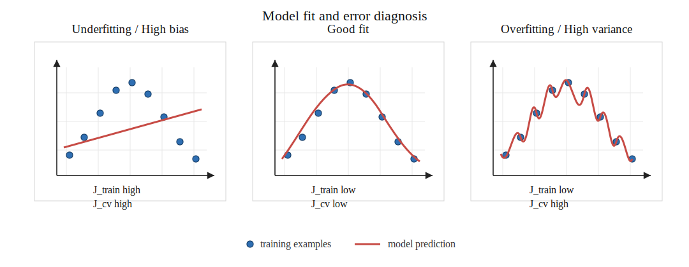

# 过拟合问题

过拟合是监督学习中的核心问题之一。参考吴恩达《Machine Learning Specialization》中对过拟合、欠拟合、偏差和方差的讲解，学习过拟合时需要把问题拆成六件事：模型复杂度、训练误差与验证误差、偏差和方差、正则化、数据划分和学习曲线诊断。

## 1. 过拟合和欠拟合

监督学习的目标不是只在训练集上表现好，而是在新的、未见过的数据上表现好。训练集表现和新数据表现之间的差距，是判断模型泛化能力的关键依据。

欠拟合指模型过于简单，无法捕捉训练数据中的主要规律。欠拟合时，训练误差和验证误差都高。

过拟合指模型过于复杂，把训练集中的噪声或偶然模式也学进去了。过拟合时，训练误差低，验证误差高。

合适的模型复杂度位于欠拟合和过拟合之间：训练误差较低，同时验证误差也较低。

## 2. 模型复杂度

模型复杂度越高，模型表达能力越强。表达能力增强后，模型可以拟合更复杂的数据模式，也会更容易贴合训练集中的噪声。

以多项式回归为例：

$$
f_{w,b}(x)=w_1x+b
$$

这是一次模型，表达能力较弱，容易欠拟合。

$$
f_{\mathbf{w},b}(x)=w_1x+w_2x^2+w_3x^3+b
$$

这是三次模型，表达能力更强，可以拟合非线性趋势。

$$
f_{\mathbf{w},b}(x)=w_1x+w_2x^2+\cdots+w_{10}x^{10}+b
$$

这是十次模型，表达能力很强；如果训练样本数量有限，它会把训练集中的局部波动也拟合进去。

模型复杂度不是越高越好。训练集误差下降不能单独证明模型更好，验证集误差才是判断泛化能力的直接依据。

## 3. 训练集、验证集和测试集

为了判断模型是否过拟合，数据通常划分为三部分：

- 训练集：用于学习参数 $\mathbf{w}$ 和 $b$
- 验证集：用于选择模型复杂度、正则化参数和其他超参数
- 测试集：用于在最终模型确定后评估泛化误差

常见划分方式为：

$$
60\% \text{ training set},\quad 20\% \text{ cross validation set},\quad 20\% \text{ test set}
$$

验证集不能用于最终报告模型性能，因为模型选择过程已经使用了验证集。测试集只在模型选择完成后使用，用于评估最终模型在新数据上的表现。

## 4. 训练误差、验证误差、偏差和方差

以平方误差为例，训练误差可以写成：

$$
J_{train}(\mathbf{w},b)=
\frac{1}{2m_{train}}
\sum_{i=1}^{m_{train}}
(f_{\mathbf{w},b}(\mathbf{x}^{(i)})-y^{(i)})^2
$$

验证误差可以写成：

$$
J_{cv}(\mathbf{w},b)=
\frac{1}{2m_{cv}}
\sum_{i=1}^{m_{cv}}
(f_{\mathbf{w},b}(\mathbf{x}_{cv}^{(i)})-y_{cv}^{(i)})^2
$$

诊断规则如下：

- $J_{train}$ 高，$J_{cv}$ 高：欠拟合，高偏差
- $J_{train}$ 低，$J_{cv}$ 高：过拟合，高方差
- $J_{train}$ 低，$J_{cv}$ 低：模型复杂度合适

训练误差衡量模型对训练数据的拟合程度，验证误差衡量模型对未参与训练数据的泛化能力。

吴恩达课程中用偏差和方差解释欠拟合与过拟合。

高偏差对应欠拟合。模型假设过于简单，训练集和验证集上都表现差。例如，用直线拟合明显弯曲的数据。

高方差对应过拟合。模型对训练集细节过度敏感，训练集表现好，验证集表现差。例如，用高次多项式穿过几乎所有训练点。

偏差和方差诊断不是看单个误差值，而是看训练误差和验证误差之间的关系。

## 5. 正则化

正则化是控制过拟合的常用方法。它在代价函数中加入对参数大小的惩罚，使模型不依赖过大的权重来贴合训练集细节。

线性回归加入正则化后的代价函数为：

$$
J(\mathbf{w},b)=
\frac{1}{2m}\sum_{i=1}^{m}
(f_{\mathbf{w},b}(\mathbf{x}^{(i)})-y^{(i)})^2
+
\frac{\lambda}{2m}\sum_{j=1}^{n}w_j^2
$$

逻辑回归加入正则化后的代价函数为：

$$
J(\mathbf{w}, b) =
-\frac{1}{m}\sum_{i=1}^{m}
\left[
y^{(i)}\log(f_{\mathbf{w},b}(\mathbf{x}^{(i)}))
+(1-y^{(i)})\log(1-f_{\mathbf{w},b}(\mathbf{x}^{(i)}))
\right]
+
\frac{\lambda}{2m}\sum_{j=1}^{n}w_j^2
$$

线性回归中，关于 $w_j$ 和 $b$ 的偏导数分别为：

$$
\frac{\partial J(\mathbf{w},b)}{\partial w_j}
=
\frac{1}{m}\sum_{i=1}^{m}
\left(f_{\mathbf{w},b}(\mathbf{x}^{(i)})-y^{(i)}\right)x_j^{(i)}
+
\frac{\lambda}{m}w_j,
\quad j=1,\ldots,n
$$

$$
\frac{\partial J(\mathbf{w},b)}{\partial b}
=
\frac{1}{m}\sum_{i=1}^{m}
\left(f_{\mathbf{w},b}(\mathbf{x}^{(i)})-y^{(i)}\right)
$$

逻辑回归中，关于 $w_j$ 和 $b$ 的偏导数分别为：

$$
\frac{\partial J(\mathbf{w},b)}{\partial w_j}
=
\frac{1}{m}\sum_{i=1}^{m}
\left(f_{\mathbf{w},b}(\mathbf{x}^{(i)})-y^{(i)}\right)x_j^{(i)}
+
\frac{\lambda}{m}w_j,
\quad j=1,\ldots,n
$$

$$
\frac{\partial J(\mathbf{w},b)}{\partial b}
=
\frac{1}{m}\sum_{i=1}^{m}
\left(f_{\mathbf{w},b}(\mathbf{x}^{(i)})-y^{(i)}\right)
$$

其中，$\lambda$ 是正则化参数。$\lambda$ 越大，对参数的惩罚越强，模型越简单。$\lambda$ 越小，对参数的约束越弱，模型越复杂。课程中正则化项不包含偏置参数 $b$。

选择 $\lambda$ 时，应在验证集上比较不同取值的误差，而不是只看训练误差。

## 6. 处理过拟合的方法

发现过拟合后，可以使用以下方法降低方差：

- 增加训练数据
- 选择并使用特征的子集
- 增大正则化参数 $\lambda$

增加训练数据可以让模型看到更多真实变化，减少对少量样本中偶然模式的依赖。减少特征数量和降低多项式阶数可以直接降低模型复杂度。增大正则化参数可以限制权重大小，使模型曲线更平滑。

## 7. 处理欠拟合的方法

发现欠拟合后，可以使用以下方法降低偏差：

- 增加输入特征
- 构造多项式特征
- 减小正则化参数 $\lambda$
- 使用表达能力更强的模型

欠拟合的核心问题是模型表达能力不足，因此需要提高模型复杂度或减弱正则化约束。

## 8. 小结

过拟合的本质是模型在训练集上学到了过多细节，导致新数据表现变差。判断过拟合不能只看训练误差，而要同时比较训练误差和验证误差。高偏差对应欠拟合，高方差对应过拟合。解决过拟合的核心方法是降低模型复杂度、增加训练数据或加强正则化。

## 参考资料

- Andrew Ng, DeepLearning.AI and Stanford Online, [Machine Learning Specialization](https://www.deeplearning.ai/specializations/machine-learning/)
- Coursera, [Supervised Machine Learning: Regression and Classification](https://www.coursera.org/learn/machine-learning)
