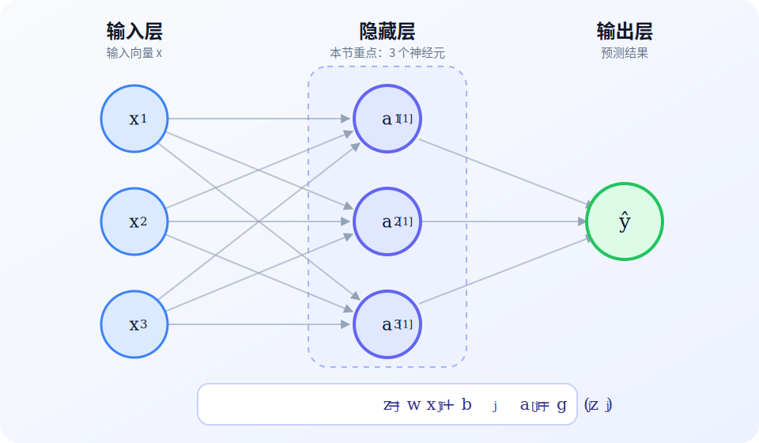
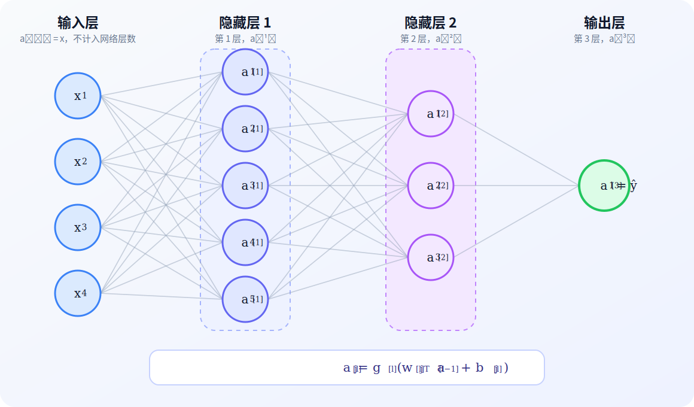

# 神经网络层
## 1. 神经元与大脑

人工神经网络的早期研究受到生物神经元启发，但人工神经元不是生物神经元的精确模型。对机器学习而言，神经元是一个接收输入、执行加权求和并通过激活函数产生输出的计算单元。

设输入特征为 $\mathbf{x}=[x_1,x_2,\ldots,x_n]^\mathsf{T}$，一个神经元包含权重 $\mathbf{w}$ 和偏置 $b$。它先计算：

$$
z=\mathbf{w}^\mathsf{T}\mathbf{x}+b
$$

再通过激活函数 $g$ 得到激活值：

$$
a=g(z)
$$

这里的 $a$ 是该神经元的输出。若使用 Sigmoid 激活函数，

$$
g(z)=\frac{1}{1+e^{-z}}
$$

则 $a$ 位于 $0$ 和 $1$ 之间，可以表示二分类事件发生的概率。逻辑回归因此也可以视为只有一个神经元的神经网络。


## 2. 神经网络层

一个神经网络层由若干神经元组成。设该层接收 $n_{\text{in}}$ 个输入，并包含 $n_{\text{units}}$ 个神经元。第 $j$ 个神经元的计算为：



$$
z_j=\mathbf{w}_j^\mathsf{T}\mathbf{x}+b_j
$$

$$
a_j=g_j(z_j),
\quad j=1,2,\ldots,n_{\text{units}}
$$

其中，$\mathbf{w}_j\in\mathbb{R}^{n_{\text{in}}}$，$b_j\in\mathbb{R}$，$a_j$ 是第 $j$ 个神经元的输出。每个神经元都接收完整输入 $\mathbf{x}$，但使用自己的 $\mathbf{w}_j$、$b_j$ 和激活函数 $g_j$。

把所有神经元的输出按顺序组合，就得到该层的输出向量：

$$
\mathbf{a}
=
\begin{bmatrix}
a_1\\
a_2\\
\vdots\\
a_{n_{\text{units}}}
\end{bmatrix}
$$

令权重矩阵的每一列对应一个神经元的权重，

$$
\mathbf{W}
=
\begin{bmatrix}
\mathbf{w}_1 & \mathbf{w}_2 & \cdots & \mathbf{w}_{n_{\text{units}}}
\end{bmatrix}
\in\mathbb{R}^{n_{\text{in}}\times n_{\text{units}}}
$$

并令

$$
\mathbf{b}
=
\begin{bmatrix}
b_1 & b_2 & \cdots & b_{n_{\text{units}}}
\end{bmatrix}^{\mathsf{T}}
\in\mathbb{R}^{n_{\text{units}}}
$$

则整层可以写成：

$$
\mathbf{z}=\mathbf{W}^\mathsf{T}\mathbf{x}+\mathbf{b}
$$

$$
\mathbf{a}=\mathbf{g}(\mathbf{z})
$$

此时 $\mathbf{x}\in\mathbb{R}^{n_{\text{in}}}$，$\mathbf{z},\mathbf{a}\in\mathbb{R}^{n_{\text{units}}}$。$\mathbf{g}$ 表示对 $\mathbf{z}$ 的各个分量应用对应的激活函数。输入向量也常记为 $\mathbf{a}^{[0]}=\mathbf{x}$，当前层的输出记为 $\mathbf{a}^{[1]}$；输入本身不执行神经元计算，因此不计作计算层。

## 3. 更复杂的神经网络

更复杂的神经网络包含多个计算层，每一层都把前一层的激活值作为输入，并产生新的激活值。输入记为 $\mathbf{a}^{[0]}=\mathbf{x}$，它只负责提供数据，不计入网络层数。若网络共有 $L$ 个计算层，则隐藏层编号为 $1,\ldots,L-1$，输出层编号为 $L$。



设第 $l-1$ 层包含 $n_{l-1}$ 个神经元，第 $l$ 层包含 $n_l$ 个神经元。第 $l$ 层的第 $j$ 个神经元接收完整的 $\mathbf{a}^{[l-1]}$，计算：

$$
z_j^{[l]}
=
\left(\mathbf{w}_j^{[l]}\right)^\mathsf{T}
\mathbf{a}^{[l-1]}
+
b_j^{[l]}
$$

$$
a_j^{[l]}=g_j^{[l]}\left(z_j^{[l]}\right),
\quad j=1,2,\ldots,n_l
$$

其中，$\mathbf{w}_j^{[l]}\in\mathbb{R}^{n_{l-1}}$ 是该神经元的权重，$b_j^{[l]}\in\mathbb{R}$ 是偏置，$a_j^{[l]}$ 是输出激活值。上标 $[l]$ 表示参数和激活值属于第 $l$ 层，下标 $j$ 表示该层中的第 $j$ 个神经元。

将第 $l$ 层所有神经元的权重按列组成矩阵：

$$
\mathbf{W}^{[l]}
=
\begin{bmatrix}
\mathbf{w}_1^{[l]} &
\mathbf{w}_2^{[l]} &
\cdots &
\mathbf{w}_{n_l}^{[l]}
\end{bmatrix}
\in\mathbb{R}^{n_{l-1}\times n_l}
$$

偏置和激活值分别组成向量 $\mathbf{b}^{[l]},\mathbf{a}^{[l]}\in\mathbb{R}^{n_l}$，因此第 $l$ 层的向量化计算为：

$$
\mathbf{z}^{[l]}
=
\left(\mathbf{W}^{[l]}\right)^\mathsf{T}
\mathbf{a}^{[l-1]}
+
\mathbf{b}^{[l]}
$$

$$
\mathbf{a}^{[l]}
=
\mathbf{g}^{[l]}\left(\mathbf{z}^{[l]}\right)
$$

图中的网络结构为 $4-5-3-1$：输入层有 $4$ 个特征，第一个隐藏层有 $5$ 个神经元，第二个隐藏层有 $3$ 个神经元，输出层有 $1$ 个神经元。输入层不计入层数，所以该网络共有 $L=3$ 个计算层，最终输出为 $\mathbf{a}^{[3]}=\hat{y}$。

## 4. 推理：预测与前向传播

推理是使用训练完成的神经网络对新输入进行预测。推理过程中，权重 $\mathbf{W}^{[l]}$ 和偏置 $\mathbf{b}^{[l]}$ 保持不变，模型只按照从输入层到输出层的方向逐层计算激活值。这个计算过程称为前向传播。

前向传播从输入开始：

$$
\mathbf{a}^{[0]}=\mathbf{x}
$$

对于第 $l$ 个计算层，依次计算：

$$
\mathbf{z}^{[l]}
=
\left(\mathbf{W}^{[l]}\right)^\mathsf{T}
\mathbf{a}^{[l-1]}
+
\mathbf{b}^{[l]}
$$

$$
\mathbf{a}^{[l]}
=
\mathbf{g}^{[l]}\left(\mathbf{z}^{[l]}\right)
$$

以第 3 节的 $4-5-3-1$ 网络为例，输入 $\mathbf{x}\in\mathbb{R}^{4}$，前向传播首先经过包含 $5$ 个神经元的第一个隐藏层：

$$
\mathbf{z}^{[1]}
=
\left(\mathbf{W}^{[1]}\right)^\mathsf{T}\mathbf{x}
+
\mathbf{b}^{[1]},
\qquad
\mathbf{a}^{[1]}
=
\mathbf{g}^{[1]}\left(\mathbf{z}^{[1]}\right)
$$

然后把 $\mathbf{a}^{[1]}\in\mathbb{R}^{5}$ 传入包含 $3$ 个神经元的第二个隐藏层：

$$
\mathbf{z}^{[2]}
=
\left(\mathbf{W}^{[2]}\right)^\mathsf{T}\mathbf{a}^{[1]}
+
\mathbf{b}^{[2]},
\qquad
\mathbf{a}^{[2]}
=
\mathbf{g}^{[2]}\left(\mathbf{z}^{[2]}\right)
$$

最后把 $\mathbf{a}^{[2]}\in\mathbb{R}^{3}$ 传入输出层：

$$
z^{[3]}
=
\left(\mathbf{W}^{[3]}\right)^\mathsf{T}\mathbf{a}^{[2]}
+
b^{[3]},
\qquad
\hat{y}=a^{[3]}=g^{[3]}\left(z^{[3]}\right)
$$

若输出层使用 Sigmoid 激活函数，则 $\hat{y}$ 表示模型预测 $y=1$ 的概率。二分类时可以使用阈值 $0.5$ 得到预测类别：

$$
\hat{c}
=
\begin{cases}
1, & \hat{y}\ge 0.5\\
0, & \hat{y}<0.5
\end{cases}
$$

前向传播只负责根据输入和已有参数计算预测结果，不更新任何参数；参数更新属于训练过程。

下面使用 NumPy 实现 $4-5-3-1$ 网络的一次前向传播。示例中的参数是固定值，只用于验证逐层计算和数组维度，不代表训练得到的模型。

```python
import numpy as np


def sigmoid(z):
    return 1 / (1 + np.exp(-z))


def dense(a_in, W, b):
    return sigmoid(W.T @ a_in + b)


x = np.array([0.8, 0.2, 0.5, 0.9])

W1 = np.array([
    [0.2, -0.1, 0.4, 0.1, -0.3],
    [0.7, 0.3, -0.2, 0.5, 0.2],
    [-0.4, 0.6, 0.1, -0.5, 0.8],
    [0.3, -0.2, 0.5, 0.4, -0.1],
])
b1 = np.array([0.1, -0.1, 0.0, 0.2, -0.2])

W2 = np.array([
    [0.3, -0.2, 0.4],
    [-0.5, 0.6, 0.1],
    [0.7, 0.2, -0.3],
    [0.1, -0.4, 0.5],
    [-0.2, 0.3, 0.6],
])
b2 = np.array([0.0, 0.1, -0.1])

W3 = np.array([
    [0.8],
    [-0.6],
    [0.5],
])
b3 = np.array([-0.2])

a1 = dense(x, W1, b1)
a2 = dense(a1, W2, b2)
a3 = dense(a2, W3, b3)

probability = a3.item()
predicted_class = int(probability >= 0.5)

print("a1 shape:", a1.shape)
print("a2 shape:", a2.shape)
print("a3 shape:", a3.shape)
print("probability:", round(probability, 4))
print("predicted class:", predicted_class)
```

运行结果为：

```text
a1 shape: (5,)
a2 shape: (3,)
a3 shape: (1,)
probability: 0.5623
predicted class: 1
```

## 5. TensorFlow 中的数据

TensorFlow 使用张量表示数据。张量是具有统一数据类型的多维数组，`shape` 表示每个轴的长度，秩表示轴的数量，`dtype` 表示元素的数据类型。这里的秩是张量轴的数量，不是线性代数中的矩阵秩。

NumPy 中的一维数组和二维矩阵具有不同的形状：

```python
import numpy as np

x_vector = np.array([200.0, 17.0], dtype=np.float32)
x_batch = np.array([[200.0, 17.0]], dtype=np.float32)

print(x_vector.shape)
print(x_batch.shape)
```

输出为：

```text
(2,)
(1, 2)
```

`x_vector` 只有特征轴，`x_batch` 同时具有批次轴和特征轴。Keras 的 `Dense` 层最常使用形状为 `(batch_size, input_dim)` 的二维输入，其中每一行表示一个样本。即使只预测一个样本，也使用形状 `(1, input_dim)`；包含 $m$ 个样本、每个样本有 $n$ 个特征的数据形状为 $(m,n)$。

对于包含 `units` 个神经元的 `Dense` 层，输入和输出形状的关系为：

$$
(\text{batch\_size},\text{input\_dim})
\longrightarrow
(\text{batch\_size},\text{units})
$$

第 2 至第 4 节使用列向量表示单个样本，因此整层公式写为 $\mathbf{W}^\mathsf{T}\mathbf{a}+\mathbf{b}$。Keras 把一批样本按行排列，权重矩阵形状为 `(input_dim, units)`，对应计算为：

$$
\mathbf{A}_{\text{out}}
=
\mathbf{A}_{\text{in}}\mathbf{W}
+
\mathbf{b}
$$

NumPy 数组可以通过 `tf.constant` 或 `tf.convert_to_tensor` 显式转换为 `tf.Tensor`，大多数 TensorFlow 运算也会自动转换兼容的 NumPy 数组。下面的示例展示数据进入 `Dense` 层前后的类型和形状：

```python
import numpy as np
import tensorflow as tf

x_numpy = np.array([[200.0, 17.0]], dtype=np.float32)
x_tensor = tf.constant(x_numpy)

layer = tf.keras.layers.Dense(units=3, activation="sigmoid")
a_tensor = layer(x_tensor)
a_numpy = a_tensor.numpy()

print("input shape:", x_tensor.shape)
print("input rank:", x_tensor.shape.rank)
print("input dtype:", x_tensor.dtype.name)
print("output shape:", a_tensor.shape)
print("converted type:", type(a_numpy).__name__)
print("converted shape:", a_numpy.shape)
```

输出中的具体激活值由 `Dense` 层初始化的参数决定，但类型和形状确定为：

```text
input shape: (1, 2)
input rank: 2
input dtype: float32
output shape: (1, 3)
converted type: ndarray
converted shape: (1, 3)
```

在 TensorFlow 2 默认的即时执行环境中，`tf.Tensor` 可以通过 `.numpy()` 转换为 NumPy 数组。模型内部计算时应继续使用张量；只有需要交给 NumPy 代码或读取最终结果时才进行转换。

## 6. PyTorch 中的数据

PyTorch 使用 `torch.Tensor` 表示模型的输入、输出和参数。张量的 `shape` 表示各轴长度，`dim()` 返回轴的数量，`dtype` 表示元素类型，`device` 表示数据所在的计算设备。与 TensorFlow 一样，批量输入通常把样本放在第一个轴，形状写为 `(batch_size, input_dim)`。

`torch.nn.Linear` 对输入的最后一个维度执行线性变换。若输入形状为 `(*, in_features)`，输出形状为 `(*, out_features)`，其中 `*` 表示任意数量的前置维度。对于二维批量输入，形状变化为：

$$
(\text{batch\_size},\text{in\_features})
\longrightarrow
(\text{batch\_size},\text{out\_features})
$$

PyTorch 的 `Linear` 权重形状为 `(out_features, in_features)`，因此批量计算写为：

$$
\mathbf{A}_{\text{out}}
=
\mathbf{A}_{\text{in}}\mathbf{W}^\mathsf{T}
+
\mathbf{b}
$$

这与 Keras `Dense` 的权重存储方向不同：Keras 的权重形状为 `(input_dim, units)`，计算时不需要再对权重矩阵转置。

NumPy 数组可以使用 `torch.from_numpy()` 或 `torch.as_tensor()` 转换为张量。`torch.from_numpy()` 创建 CPU 张量，并与原 NumPy 数组共享底层内存；修改其中一方的数据会反映到另一方。`torch.tensor()` 会复制输入数据，不共享底层内存。

下面的示例使用 `torch.tensor()` 直接创建张量，并展示张量经过 `Linear` 层及转换为 NumPy 数组后的类型与形状变化：

```python
import torch

x_tensor = torch.tensor([[200.0, 17.0]], dtype=torch.float32)

layer = torch.nn.Linear(in_features=2, out_features=3)
a_tensor = torch.sigmoid(layer(x_tensor))
a_numpy = a_tensor.detach().cpu().numpy()

print("input shape:", x_tensor.shape)
print("input dimensions:", x_tensor.dim())
print("input dtype:", x_tensor.dtype)
print("input device:", x_tensor.device)
print("weight shape:", layer.weight.shape)
print("output shape:", a_tensor.shape)
print("converted type:", type(a_numpy).__name__)
print("converted shape:", a_numpy.shape)
```

输出中的具体激活值由 `Linear` 层的随机初始化参数决定，但类型和形状确定为：

```text
input shape: torch.Size([1, 2])
input dimensions: 2
input dtype: torch.float32
input device: cpu
weight shape: torch.Size([3, 2])
output shape: torch.Size([1, 3])
converted type: ndarray
converted shape: (1, 3)
```

模型输出通常参与自动微分，或者位于 GPU 等加速设备上，因此转换为 NumPy 前先调用 `detach()` 断开自动微分记录，再调用 `cpu()` 把数据放到 CPU，最后调用 `numpy()`。这一顺序可以写成 `tensor.detach().cpu().numpy()`。

## 参考资料

Andrew Ng, DeepLearning.AI and Stanford Online, [Advanced Learning Algorithms](https://www.coursera.org/learn/advanced-learning-algorithms)

TensorFlow, [Introduction to Tensors](https://www.tensorflow.org/guide/tensor)

TensorFlow, [tf.keras.layers.Dense](https://www.tensorflow.org/api_docs/python/tf/keras/layers/Dense)

PyTorch, [Tensors](https://docs.pytorch.org/tutorials/beginner/basics/tensor_tutorial.html)

PyTorch, [torch.nn.Linear](https://docs.pytorch.org/docs/stable/generated/torch.nn.Linear.html)

PyTorch, [torch.Tensor.numpy](https://docs.pytorch.org/docs/stable/generated/torch.Tensor.numpy.html)
