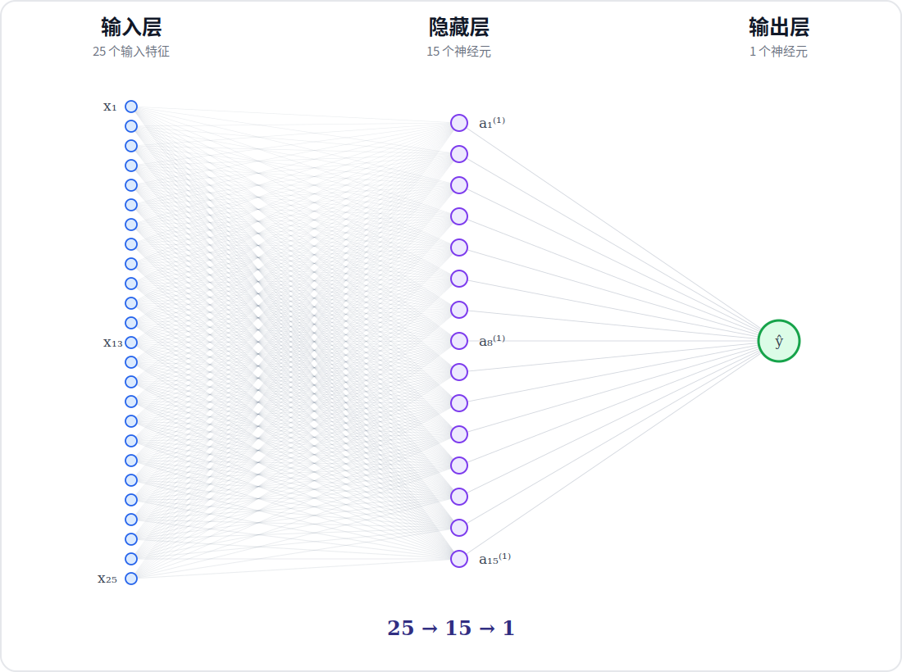

# 构建神经网络

## 1. 构建神经网络



图中的网络接收 $25$ 个输入特征，隐藏层包含 $15$ 个神经元，输出层包含 $1$ 个神经元。输入层只提供数据，不包含可训练参数；隐藏层和输出层是两个计算层。

使用 PyTorch 构建该网络时，`nn.Linear(25, 15)` 把每个样本的 $25$ 个输入特征映射为 $15$ 个隐藏层值，Sigmoid 激活函数再把线性输出转换为隐藏层激活值：

$$
\mathbf{A}^{[1]}
=
\operatorname{sigmoid}
\left(
\mathbf{X}\left(\mathbf{W}^{[1]}\right)^\mathsf{T}
+
\mathbf{b}^{[1]}
\right)
$$

`nn.Linear(15, 1)` 把 $15$ 个隐藏层激活值映射为一个输出值。二分类任务中，输出层使用 Sigmoid 后得到 $\hat{\mathbf{y}}$，其中每个值表示对应样本属于类别 $1$ 的预测概率：

$$
\hat{\mathbf{y}}
=
\operatorname{sigmoid}
\left(
\mathbf{A}^{[1]}\left(\mathbf{W}^{[2]}\right)^\mathsf{T}
+
\mathbf{b}^{[2]}
\right)
$$

PyTorch 可以使用 `nn.Sequential` 按数据经过网络的顺序组合各层：

```python
import torch
from torch import nn


model = nn.Sequential(
    # 隐藏层把每个样本的 25 个输入特征映射为 15 个值。
    nn.Linear(in_features=25, out_features=15),
    # 将隐藏层的线性输出转换为激活值。
    nn.Sigmoid(),
    # 输出层把 15 个隐藏层激活值映射为一个二分类输出。
    nn.Linear(in_features=15, out_features=1),
    # 将输出转换为类别 1 的预测概率。
    nn.Sigmoid(),
)

# 该批次包含 4 个样本，每个样本包含 25 个输入特征。
x = torch.rand(4, 25)

# 此处只执行预测，不记录参数梯度。
with torch.no_grad():
    y_hat = model(x)

print("input shape:", x.shape)
print("output shape:", y_hat.shape)
print("hidden weight shape:", model[0].weight.shape)
print("hidden bias shape:", model[0].bias.shape)
print("output weight shape:", model[2].weight.shape)
print("output bias shape:", model[2].bias.shape)
```

预期输出：

```text
input shape: torch.Size([4, 25])
output shape: torch.Size([4, 1])
hidden weight shape: torch.Size([15, 25])
hidden bias shape: torch.Size([15])
output weight shape: torch.Size([1, 15])
output bias shape: torch.Size([1])
```

输入批次形状为 `(4, 25)`，网络对每个样本独立执行相同计算，因此输出形状为 `(4, 1)`。各参数形状由 `nn.Linear` 的 `in_features` 和 `out_features` 决定：

$$
\mathbf{W}^{[1]}\in\mathbb{R}^{15\times25},
\qquad
\mathbf{b}^{[1]}\in\mathbb{R}^{15}
$$

$$
\mathbf{W}^{[2]}\in\mathbb{R}^{1\times15},
\qquad
\mathbf{b}^{[2]}\in\mathbb{R}^{1}
$$

第一层包含 $15\times25+15=390$ 个参数，第二层包含 $1\times15+1=16$ 个参数，所以网络的可训练参数总数为：

$$
390+16=406
$$

`nn.Sequential` 只定义网络结构和前向计算顺序，不会自动完成训练；损失函数、优化器和参数更新属于后续训练流程。

## 参考资料

Andrew Ng, DeepLearning.AI and Stanford Online, [Advanced Learning Algorithms](https://www.coursera.org/learn/advanced-learning-algorithms)

PyTorch, [torch.nn.Sequential](https://docs.pytorch.org/docs/stable/generated/torch.nn.Sequential.html)

PyTorch, [torch.nn.Linear](https://docs.pytorch.org/docs/stable/generated/torch.nn.Linear.html)
