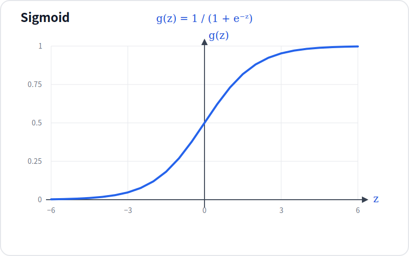
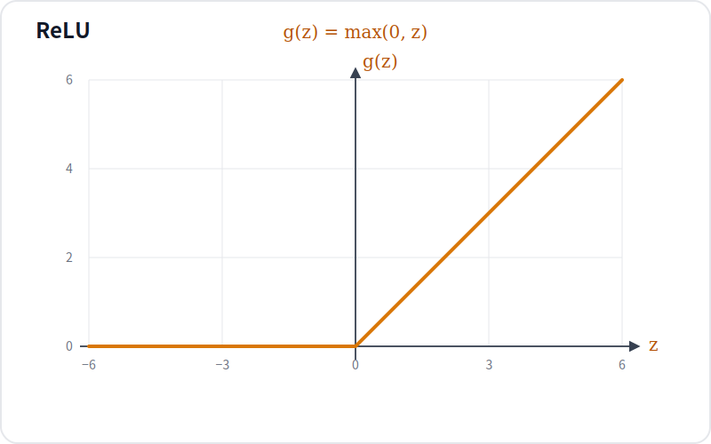
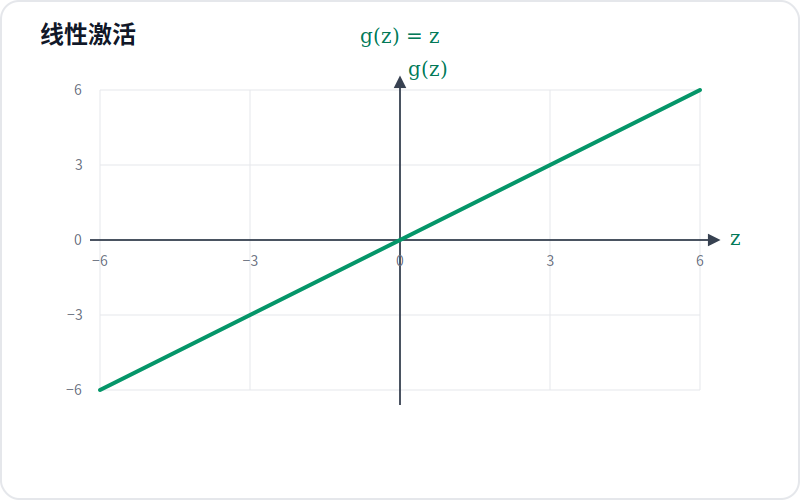

# 激活函数的选择

## 1. 激活函数的作用

神经元先计算线性组合：

$$
z=\mathbf{w}^\mathsf{T}\mathbf{x}+b
$$

再使用激活函数把 $z$ 转换为激活值：

$$
a=g(z)
$$

激活函数决定神经元输出的范围和非线性形式。隐藏层需要非线性激活函数来学习复杂映射，输出层则要根据预测目标的取值范围选择激活函数。

## 2. Sigmoid 激活函数

$$
g(z)=\frac{1}{1+e^{-z}}
$$



Sigmoid 把任意实数映射到 $(0,1)$，因此适合表示二分类任务中类别 $1$ 的预测概率。它的导数为：

$$
g'(z)=g(z)\left(1-g(z)\right)
$$

Sigmoid 曲线在 $z$ 很小和 $z$ 很大时都有接近水平的饱和区。此时输出分别接近 $0$ 和 $1$，导数都接近 $0$。反向传播需要逐层乘以激活函数的导数，因此隐藏层连续使用 Sigmoid 时，梯度会在经过两端饱和区时不断缩小，形成梯度消失。

PyTorch 对应 `nn.Sigmoid()`。

## 3. ReLU 激活函数

$$
g(z)=\max(0,z)
$$



ReLU 只有负半轴是水平区域：当 $z<0$ 时输出和导数都为 $0$；当 $z>0$ 时输出为 $z$，导数恒为 $1$。它不像 Sigmoid 那样在正负两端都存在饱和区，正半轴的梯度可以直接向前传播，因此隐藏层通常优先使用 ReLU。

ReLU 不能彻底消除梯度问题。如果某个神经元的输入长期落在负半轴，它的梯度会持续为 $0$，该神经元可能无法继续更新，这称为“死亡 ReLU”。ReLU 在 $z=0$ 处不可导，深度学习框架会为该点指定一个用于计算的导数值。PyTorch 对应 `nn.ReLU()`。

## 4. 线性激活函数

$$
g(z)=z
$$



线性激活函数直接返回输入，输出范围为整个实数域，导数恒为 $1$。当回归任务的目标值可以是任意实数时，输出层可以使用线性激活。在 PyTorch 中，`nn.Linear` 后不添加激活函数即可得到线性输出；需要显式占位时可以使用 `nn.Identity()`。

## 5. 如何选择激活函数

隐藏层和输出层承担的任务不同，选择规则如下：

| 使用位置 | 预测目标 | 激活函数 | PyTorch |
| --- | --- | --- | --- |
| 隐藏层 | 学习非线性特征 | ReLU | `nn.ReLU()` |
| 输出层 | 二分类概率 | Sigmoid | `nn.Sigmoid()` |
| 输出层 | 任意实数回归值 | 线性激活 | 不添加激活函数或 `nn.Identity()` |
| 输出层 | 非负回归值 | ReLU | `nn.ReLU()` |

隐藏层没有明确的特殊要求时，优先使用 ReLU。输出层不能固定使用某一种激活函数，而要让激活函数的输出范围与预测目标的取值范围一致。

## 6. PyTorch 示例

下面构建一个二分类网络。隐藏层使用 ReLU 学习非线性特征，输出层使用 Sigmoid 生成类别 $1$ 的预测概率：

```python
import torch
from torch import nn


class BinaryClassifier(nn.Module):
    def __init__(self):
        super().__init__()
        self.hidden = nn.Linear(in_features=25, out_features=15)
        self.hidden_activation = nn.ReLU()
        self.output = nn.Linear(in_features=15, out_features=1)
        self.output_activation = nn.Sigmoid()

    def forward(self, x):
        # ReLU 使隐藏层能够表示输入特征之间的非线性关系。
        hidden = self.hidden_activation(self.hidden(x))
        # Sigmoid 将输出限制在 (0, 1)，用于表示二分类概率。
        return self.output_activation(self.output(hidden))


model = BinaryClassifier()
x = torch.rand(4, 25)

# 推理阶段不需要构建用于参数更新的计算图。
with torch.no_grad():
    probabilities = model(x)

print("input shape:", x.shape)
print("output shape:", probabilities.shape)
```

预期输出：

```text
input shape: torch.Size([4, 25])
output shape: torch.Size([4, 1])
```

输入形状为 `(4, 25)`，输出形状为 `(4, 1)`。这段代码只展示激活函数在网络中的位置，不包含损失函数、反向传播和参数更新。

## 参考资料

Andrew Ng, DeepLearning.AI and Stanford Online, [Advanced Learning Algorithms](https://www.coursera.org/learn/advanced-learning-algorithms)

PyTorch, [torch.nn.Sigmoid](https://docs.pytorch.org/docs/stable/generated/torch.nn.Sigmoid.html)

PyTorch, [torch.nn.ReLU](https://docs.pytorch.org/docs/stable/generated/torch.nn.ReLU.html)

PyTorch, [torch.nn.Identity](https://docs.pytorch.org/docs/stable/generated/torch.nn.Identity.html)
