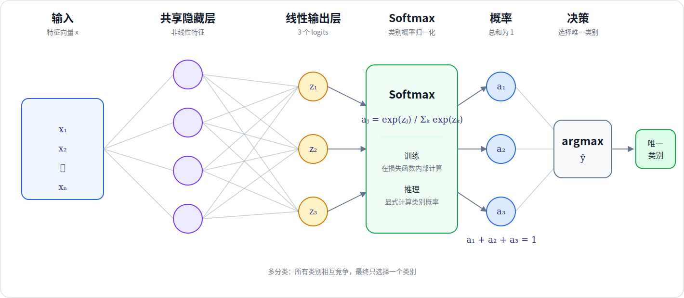

# Softmax 回归与多分类

## 1. 多分类

二分类任务只有两个互斥类别，多分类任务包含 $C\ge 3$ 个互斥类别，每个样本只属于其中一个类别。例如，手写数字识别包含 $10$ 个类别，模型需要从数字 $0$ 到 $9$ 中选择一个结果。

对于输入 $\mathbf{x}$，Softmax 回归为每个类别计算一个线性输出：

$$
z_j=\mathbf{w}_j^\mathsf{T}\mathbf{x}+b_j,
\quad j=1,2,\ldots,C
$$

$z_j$ 称为第 $j$ 个类别的 logit。logit 可以是任意实数，它不是概率，也不要求所有 logits 的和为 $1$。模型需要把 logits 转换为类别概率，再选择概率最大的类别。

## 2. Softmax

Softmax 将 $C$ 个 logits 转换为 $C$ 个类别概率：

$$
a_j
=
\frac{e^{z_j}}
{\sum_{k=1}^{C}e^{z_k}},
\quad j=1,2,\ldots,C
$$

每个 $a_j$ 都位于 $(0,1)$，并且：

$$
\sum_{j=1}^{C}a_j=1
$$

因此，$a_j$ 可以解释为模型预测样本属于第 $j$ 类的概率。预测类别为概率最大的类别：

$$
\hat{y}=\operatorname*{arg\,max}_{j}a_j
$$

由于指数函数严格单调，最大 logit 对应最大 Softmax 概率，因此也可以直接计算：

$$
\hat{y}=\operatorname*{arg\,max}_{j}z_j
$$

当 $C=2$ 时，Softmax 可以化为 Sigmoid。以第 $2$ 类为例：

$$
a_2
=
\frac{e^{z_2}}{e^{z_1}+e^{z_2}}
=
\frac{1}{1+e^{-(z_2-z_1)}}
$$

Softmax 回归因此是逻辑回归从二分类到多分类的扩展。

## 3. Softmax 回归的损失函数

设真实类别为 $y$，模型对真实类别给出的概率为 $a_y$，单个样本的交叉熵损失为：

$$
L(\mathbf{a},y)=-\log(a_y)
$$

当 $a_y$ 接近 $1$ 时，损失接近 $0$；当 $a_y$ 接近 $0$ 时，损失会变得很大。若使用 one-hot 标签 $\mathbf{y}=[y_1,\ldots,y_C]^\mathsf{T}$，同一损失可以写为：

$$
L(\mathbf{a},\mathbf{y})
=
-\sum_{j=1}^{C}y_j\log(a_j)
$$

训练集包含 $m$ 个样本时，Softmax 回归的代价函数为：

$$
J(\mathbf{W},\mathbf{b})
=
\frac{1}{m}
\sum_{i=1}^{m}
L\left(\mathbf{a}^{(i)},y^{(i)}\right)
$$

训练的目标是调整所有类别对应的权重和偏置，使真实类别的预测概率增大，从而降低平均交叉熵损失。

## 4. 带 Softmax 输出的神经网络

Softmax 回归直接从输入计算 $C$ 个 logits。神经网络可以先使用隐藏层学习非线性特征，再让输出层包含 $C$ 个神经元：



$$
\mathbf{z}^{[L]}
=
\left(\mathbf{W}^{[L]}\right)^\mathsf{T}
\mathbf{a}^{[L-1]}
+
\mathbf{b}^{[L]}
$$

$$
a_j^{[L]}
=
\frac{e^{z_j^{[L]}}}
{\sum_{k=1}^{C}e^{z_k^{[L]}}},
\quad j=1,2,\ldots,C
$$

对于包含 $m$ 个样本的批次，输出层 logits 的形状为 $(m,C)$，Softmax 概率的形状同样为 $(m,C)$。Softmax 必须沿类别维度计算，使每个样本对应的一行概率之和为 $1$。

## 5. Softmax 的数值稳定实现

概念上可以先计算 Softmax 概率，再计算交叉熵损失：

$$
\mathbf{z}
\longrightarrow
\mathbf{a}=\operatorname{softmax}(\mathbf{z})
\longrightarrow
L=-\log(a_y)
$$

但计算机需要对每一步结果进行有限精度舍入。当不同类别的 logits 相差很大时，Softmax 概率可能被舍入为非常接近 $0$ 或 $1$ 的值；随后再计算对数会放大误差，概率被舍入为 $0$ 时还会出现 $\log(0)$。因此，训练时不应让模型输出层先单独计算并保存 Softmax 概率。

改进实现分成两个职责。模型输出层使用线性激活函数，直接输出 logits：

$$
\mathbf{a}^{[L]}
=
g_{\text{linear}}\left(\mathbf{z}^{[L]}\right)
=
\mathbf{z}^{[L]}
$$

损失函数接收 logits，并在损失内部计算 Softmax 和交叉熵。真实类别 $y$ 对应的 Softmax 概率为：

$$
a_y
=
\frac{e^{z_y}}
{\sum_{k=1}^{C}e^{z_k}}
$$

单样本交叉熵损失最原始的形式为：

$$
L(\mathbf{z},y)=-\log(a_y)
$$

把 $a_y$ 的 Softmax 公式代入损失函数：

$$
\begin{aligned}
L(\mathbf{z},y)
&=
-\log
\left(
\frac{e^{z_y}}
{\sum_{k=1}^{C}e^{z_k}}
\right)\\
&=
-\left[
\log(e^{z_y})
-
\log\left(\sum_{k=1}^{C}e^{z_k}\right)
\right]\\
&=
-z_y
+
\log\left(\sum_{k=1}^{C}e^{z_k}\right)
\end{aligned}
$$

因此，改进实现没有删除 Softmax，而是把 Softmax 从模型输出层移入损失函数，使 Softmax、对数和交叉熵能够合并为一次数值稳定的计算。

为了避免指数溢出，令

$$
c=\max_k z_k
$$

由于分子和分母同时乘以 $e^{-c}$ 不会改变比值：

$$
\frac{e^{z_y-c}}
{\sum_{k=1}^{C}e^{z_k-c}}
=
\frac{e^{-c}e^{z_y}}
{e^{-c}\sum_{k=1}^{C}e^{z_k}}
=
\frac{e^{z_y}}
{\sum_{k=1}^{C}e^{z_k}}
$$

所以稳定形式可以从原始损失继续推导：

$$
\begin{aligned}
L(\mathbf{z},y)
&=
-\log
\left(
\frac{e^{z_y-c}}
{\sum_{k=1}^{C}e^{z_k-c}}
\right)\\
&=
-(z_y-c)
+
\log\left(\sum_{k=1}^{C}e^{z_k-c}\right)
\end{aligned}
$$

此时所有 $z_k-c\le 0$，既保留原始 Softmax 概率，又避免计算过大的指数。

在 PyTorch 中，输出层只使用 `nn.Linear` 产生 logits，不在模型末尾添加 `nn.Softmax`。训练时把 logits 直接传给 `nn.CrossEntropyLoss`；它等价于在损失内部依次计算 `LogSoftmax` 和负对数似然损失，其中 `LogSoftmax` 同时完成 Softmax 与取对数。

当标签使用类别索引时，logits 的形状为 `(batch_size, C)`，标签的形状为 `(batch_size,)`，标签类型为 `torch.long`，每个值位于 $[0,C)$。推理阶段需要显示类别概率时，再调用 `torch.softmax(logits, dim=1)`；如果只需要预测类别，可以直接对 logits 使用 `argmax`。

## 6. PyTorch 示例

下面构建一个三分类神经网络。输出层只产生三个 logits，不在模型内部添加 Softmax：

```python
import torch
from torch import nn


class MulticlassClassifier(nn.Module):
    def __init__(self):
        super().__init__()
        self.hidden = nn.Linear(in_features=25, out_features=15)
        self.hidden_activation = nn.ReLU()
        # 三个输出分别对应三个类别的 logits。
        self.output = nn.Linear(in_features=15, out_features=3)

    def forward(self, x):
        hidden = self.hidden_activation(self.hidden(x))
        # 训练损失需要原始 logits，因此这里不调用 Softmax。
        return self.output(hidden)


model = MulticlassClassifier()
x = torch.rand(4, 25)
# 类别索引必须使用 torch.long，三分类的有效范围是 [0, 3)。
targets = torch.tensor([0, 2, 1, 2], dtype=torch.long)

logits = model(x)
criterion = nn.CrossEntropyLoss()
# CrossEntropyLoss 直接接收 logits 和类别索引。
loss = criterion(logits, targets)

with torch.no_grad():
    inference_logits = model(x)
    # dim=1 表示沿每个样本的类别维度计算概率。
    probabilities = torch.softmax(inference_logits, dim=1)
    predictions = torch.argmax(inference_logits, dim=1)

print("logits shape:", logits.shape)
print("probabilities shape:", probabilities.shape)
print("probability sums:", probabilities.sum(dim=1))
print("predictions:", predictions)
print("loss:", loss.item())
```

`logits` 和 `probabilities` 的形状均为 `(4, 3)`，`predictions` 的形状为 `(4,)`。每个样本的三个概率之和为 $1$。这段代码展示 Softmax 多分类的前向计算和损失计算，不包含优化器与参数更新。

## 参考资料

Andrew Ng, DeepLearning.AI and Stanford Online, [Advanced Learning Algorithms](https://www.coursera.org/learn/advanced-learning-algorithms)

PyTorch, [torch.nn.Softmax](https://docs.pytorch.org/docs/stable/generated/torch.nn.Softmax.html)

PyTorch, [torch.nn.CrossEntropyLoss](https://docs.pytorch.org/docs/stable/generated/torch.nn.CrossEntropyLoss.html)
