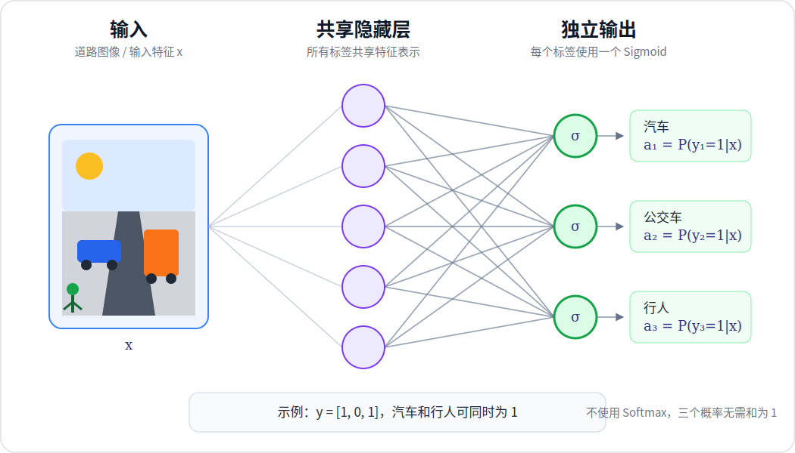

# 多标签分类问题

吴恩达《Machine Learning Specialization》的《Advanced Learning Algorithms》课程在“Classification with multiple outputs”中介绍多标签分类：一个样本可以同时具有多个标签，网络中的每个输出单元分别判断一个标签是否存在。

## 1. 多标签分类

在道路图像中，汽车、公交车和行人可以同时出现。若三个标签依次表示“汽车、公交车、行人”，一张同时包含汽车和行人但不包含公交车的图像可以写成：

$$
\mathbf{y}
=
\begin{bmatrix}
1\\
0\\
1
\end{bmatrix}
$$



包含 $C$ 个标签时，目标向量为：

$$
\mathbf{y}
=
\begin{bmatrix}
y_1 & y_2 & \cdots & y_C
\end{bmatrix}^{\mathsf{T}},
\qquad
y_j\in\{0,1\}
$$

同一个目标向量中可以有多个元素等于 $1$，所以多标签分类不是从 $C$ 个类别中选择唯一一个类别，而是同时解决 $C$ 个相关的二分类问题。

## 2. 多分类与多标签分类

| 对比项 | 多分类 | 多标签分类 |
| --- | --- | --- |
| 单个样本的正确标签数 | 恰好一个 | 可以是零个、一个或多个 |
| 目标表示 | 单个类别索引 | 长度为 $C$ 的二进制向量 |
| 输出激活 | Softmax | 每个输出独立使用 Sigmoid |
| 概率关系 | 所有类别概率之和为 $1$ | 各标签概率互不约束，无需和为 $1$ |
| 常用损失 | 多分类交叉熵 | 逐标签二元交叉熵 |

Softmax 适用于类别互斥的问题，因为增加一个类别的概率会降低其他类别的概率。多标签问题中的汽车和行人可以同时存在，所以每个标签都需要独立的 Sigmoid 概率，不能使用 Softmax 强制竞争。

## 3. 神经网络的多个独立输出

设最后一个隐藏层的激活值为 $\mathbf{a}^{[L-1]}$，输出层包含 $C$ 个神经元。第 $j$ 个输出神经元计算：

$$
z_j
=
\mathbf{w}_j^\mathsf{T}\mathbf{a}^{[L-1]}
+
b_j
$$

$$
a_j
=
\sigma(z_j)
=
\frac{1}{1+e^{-z_j}}
$$

$a_j$ 表示第 $j$ 个标签存在的预测概率：

$$
a_j=P(y_j=1\mid\mathbf{x})
$$

各标签分别计算 Sigmoid，因此一般不存在

$$
\sum_{j=1}^{C}a_j=1
$$

这一约束。使用阈值 $t_j$ 可以把概率转换为二进制预测：

$$
\hat{y}_j
=
\begin{cases}
1, & a_j\ge t_j\\
0, & a_j<t_j
\end{cases}
$$

课程中的基础示例可以令所有 $t_j=0.5$。实际任务也可以根据不同标签的代价和数据分布分别选择阈值。

## 4. 多标签二元交叉熵

每个标签都是一个二分类任务，因此第 $j$ 个标签的损失为：

$$
L_j
=
-\left[
y_j\log(a_j)
+
(1-y_j)\log(1-a_j)
\right]
$$

对一个样本的 $C$ 个标签取平均：

$$
L(\mathbf{a},\mathbf{y})
=
-\frac{1}{C}
\sum_{j=1}^{C}
\left[
y_j\log(a_j)
+
(1-y_j)\log(1-a_j)
\right]
$$

包含 $m$ 个样本时，代价函数为：

$$
J
=
\frac{1}{m}
\sum_{i=1}^{m}
L\left(\mathbf{a}^{(i)},\mathbf{y}^{(i)}\right)
$$

这个损失允许模型同时提高多个正确标签的概率，也允许同时降低多个错误标签的概率。

## 5. 数值稳定实现

与 Softmax 多分类相同，训练时不应在模型输出层单独计算并保存概率。模型输出层使用线性函数直接产生每个标签的 logits：

$$
\mathbf{z}
=
\mathbf{W}^\mathsf{T}\mathbf{a}^{[L-1]}
+
\mathbf{b}
$$

损失函数内部再对每个 logit 计算 Sigmoid 和二元交叉熵。PyTorch 的 `nn.BCEWithLogitsLoss` 将 Sigmoid 与二元交叉熵合并为一次数值稳定的计算，因此模型末尾不添加 `nn.Sigmoid`。

`BCEWithLogitsLoss` 要求 logits 与目标张量形状相同，均为 `(batch_size, C)`；目标值使用浮点数 $0.0$ 或 $1.0$。推理阶段需要标签概率时，再调用 `torch.sigmoid(logits)`，然后逐元素应用阈值。

## 6. PyTorch 示例

下面构建一个具有“汽车、公交车、行人”三个标签的多标签分类网络：

```python
import torch
from torch import nn


torch.manual_seed(0)


class MultiLabelClassifier(nn.Module):
    def __init__(self):
        super().__init__()
        self.hidden = nn.Linear(in_features=25, out_features=15)
        self.hidden_activation = nn.ReLU()
        # 三个线性输出分别对应汽车、公交车和行人的 logits。
        self.output = nn.Linear(in_features=15, out_features=3)

    def forward(self, x):
        hidden = self.hidden_activation(self.hidden(x))
        # BCEWithLogitsLoss 需要原始 logits，因此模型内不调用 Sigmoid。
        return self.output(hidden)


model = MultiLabelClassifier()
x = torch.rand(4, 25)
# 每行对应一个样本，每列对应一个标签；同一行可以包含多个 1。
targets = torch.tensor([
    [1.0, 0.0, 1.0],
    [0.0, 1.0, 0.0],
    [1.0, 1.0, 0.0],
    [0.0, 0.0, 1.0],
])

logits = model(x)
criterion = nn.BCEWithLogitsLoss()
loss = criterion(logits, targets)

with torch.no_grad():
    inference_logits = model(x)
    # 推理时每个标签独立计算 Sigmoid 概率并应用阈值。
    probabilities = torch.sigmoid(inference_logits)
    predictions = (probabilities >= 0.5).to(torch.int64)

print("logits shape:", logits.shape)
print("targets shape:", targets.shape)
print("probabilities shape:", probabilities.shape)
print("predictions:", predictions)
print("loss:", loss.item())
```

预期输出：

```text
logits shape: torch.Size([4, 3])
targets shape: torch.Size([4, 3])
probabilities shape: torch.Size([4, 3])
predictions: tensor([[1, 1, 0],
        [0, 1, 0],
        [0, 1, 0],
        [0, 1, 0]])
loss: 0.6948112845420837
```

`logits`、`targets` 和 `probabilities` 的形状均为 `(4, 3)`。`predictions` 中每行可以包含多个 $1$，这正是多标签分类与 Softmax 多分类的核心区别。

## 参考资料

Andrew Ng, DeepLearning.AI and Stanford Online, [Advanced Learning Algorithms](https://www.coursera.org/learn/advanced-learning-algorithms)

PyTorch, [torch.nn.BCEWithLogitsLoss](https://docs.pytorch.org/docs/stable/generated/torch.nn.BCEWithLogitsLoss.html)

PyTorch, [torch.nn.Sigmoid](https://docs.pytorch.org/docs/stable/generated/torch.nn.Sigmoid.html)
