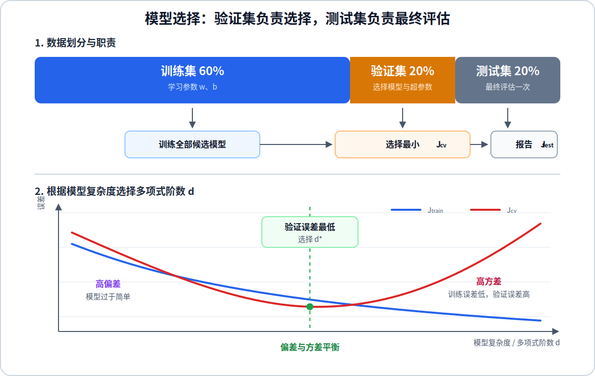
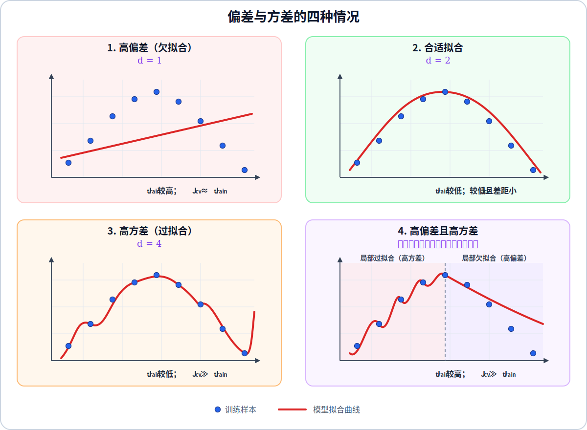
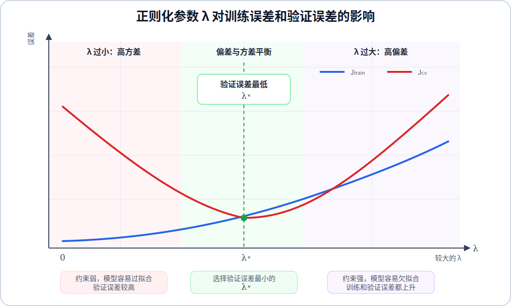
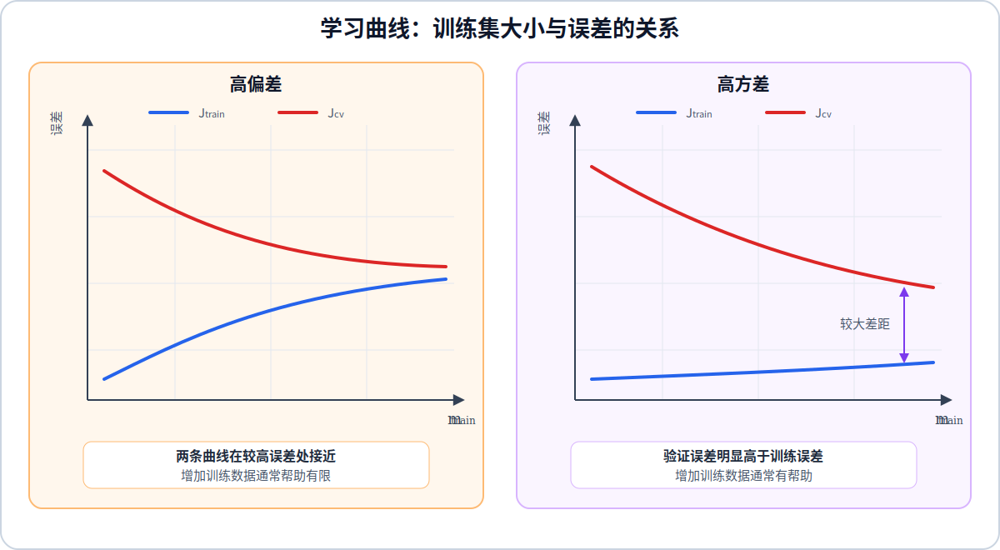

# 模型的选择

模型选择的目标是在多个候选模型中，选择对新数据泛化能力最好的模型。候选模型可以具有不同的多项式阶数、正则化参数、特征集合或神经网络结构。不能根据训练误差选择模型，因为更复杂的模型通常能得到更低的训练误差；也不能根据测试误差反复选择模型，否则测试集会参与模型决策，失去独立评估作用。

## 1. 训练集、验证集和测试集

为了把模型选择和最终评估分开，课程将数据划分为三部分：

$$
60\% \text{ training set},
\qquad
20\% \text{ cross validation set},
\qquad
20\% \text{ test set}
$$

训练集用于学习参数 $\mathbf{w}$ 和 $b$，验证集也称为交叉验证集或开发集，用于比较候选模型和选择超参数，测试集只用于评估已经确定的最终模型。

设三个数据集的样本数量分别为 $m_{\text{train}}$、$m_{\text{cv}}$ 和 $m_{\text{test}}$：

$$
m
=
m_{\text{train}}
+
m_{\text{cv}}
+
m_{\text{test}}
$$

以平方误差为例，三个误差分别为：

$$
J_{\text{train}}(\mathbf{w},b)
=
\frac{1}{2m_{\text{train}}}
\sum_{i=1}^{m_{\text{train}}}
\left(
f_{\mathbf{w},b}\left(\mathbf{x}_{\text{train}}^{(i)}\right)
-y_{\text{train}}^{(i)}
\right)^2
$$

$$
J_{\text{cv}}(\mathbf{w},b)
=
\frac{1}{2m_{\text{cv}}}
\sum_{i=1}^{m_{\text{cv}}}
\left(
f_{\mathbf{w},b}\left(\mathbf{x}_{\text{cv}}^{(i)}\right)
-y_{\text{cv}}^{(i)}
\right)^2
$$

$$
J_{\text{test}}(\mathbf{w},b)
=
\frac{1}{2m_{\text{test}}}
\sum_{i=1}^{m_{\text{test}}}
\left(
f_{\mathbf{w},b}\left(\mathbf{x}_{\text{test}}^{(i)}\right)
-y_{\text{test}}^{(i)}
\right)^2
$$

这些误差用于衡量预测性能，因此都不包含正则化项。

## 2. 使用验证集选择模型

假设需要在十个多项式回归模型中选择一个模型，第 $d$ 个候选模型为：

$$
f_{\mathbf{w},b}^{(d)}(x)
=
w_1x+w_2x^2+\cdots+w_dx^d+b,
\qquad
d=1,2,\ldots,10
$$

对于每个 $d$，只使用训练集学习对应参数 $\mathbf{w}^{(d)}$ 和 $b^{(d)}$，然后在验证集上计算误差：

$$
J_{\text{cv}}
\left(
\mathbf{w}^{(d)},b^{(d)}
\right)
$$

选择验证误差最小的多项式阶数：

$$
d^*
=
\operatorname*{arg\,min}_{d\in\{1,\ldots,10\}}
J_{\text{cv}}
\left(
\mathbf{w}^{(d)},b^{(d)}
\right)
$$

确定 $d^*$ 后，模型结构已经固定。此时才在测试集上计算一次：

$$
J_{\text{test}}
\left(
\mathbf{w}^{(d^*)},b^{(d^*)}
\right)
$$

$J_{\text{cv}}$ 用于做选择，$J_{\text{test}}$ 用于估计最终模型面对新数据时的泛化误差，两者不能互换。

## 3. 偏差和方差

模型复杂度较低时，模型表达能力不足，训练集和验证集上的误差都较高，这是高偏差，也就是欠拟合。模型复杂度较高时，模型可以把训练集拟合得很好，但验证误差明显高于训练误差，这是高方差，也就是过拟合。

课程使用 $d=1$、$d=2$ 和 $d=4$ 的多项式模型对比高偏差、合适拟合和高方差；第四幅图补充高偏差与高方差同时出现的情况：

图中四种情况按编号依次为：

1. 高偏差：$d=1$ 的模型过于简单，无法捕捉数据的弯曲趋势，因此训练误差较高，验证误差与训练误差接近。
2. 合适拟合：$d=2$ 的模型捕捉了主要趋势，并且没有追随局部噪声，训练误差和验证误差都较低。
3. 高方差：$d=4$ 的模型紧贴训练样本，训练误差较低，但验证误差明显更高。
4. 高偏差且高方差：同一个模型在左侧区域追随训练样本的局部变化，表现为过拟合；在右侧区域没有捕捉数据向下弯曲的趋势，表现为欠拟合。因此模型既有高偏差，也有高方差。

诊断时需要同时比较训练误差和验证误差：

$$
\begin{aligned}
\text{高偏差：}\quad
&J_{\text{train}} \text{ 较高},
\qquad
J_{\text{cv}}\approx J_{\text{train}}\\
\text{合适模型：}\quad
&J_{\text{train}} \text{ 较低},
\qquad
J_{\text{cv}}-J_{\text{train}} \text{ 较小}\\
\text{高方差：}\quad
&J_{\text{train}} \text{ 较低},
\qquad
J_{\text{cv}}\gg J_{\text{train}}\\
\text{高偏差且高方差：}\quad
&J_{\text{train}} \text{ 较高},
\qquad
J_{\text{cv}}\gg J_{\text{train}}
\end{aligned}
$$

误差的“高”或“低”必须相对于该任务可达到的基准水平判断，不存在适用于所有任务的固定阈值。

随着多项式阶数 $d$ 增大，模型复杂度提高，$J_{\text{train}}$ 通常持续下降；$J_{\text{cv}}$ 通常先下降后上升。验证误差最低的位置在偏差和方差之间取得了较好的平衡。

## 4. 选择正则化参数

正则化参数 $\lambda$ 也是需要通过验证集选择的超参数。对多个候选值分别训练模型：

$$
\lambda
\in
\left\{
0,\ 0.01,\ 0.02,\ 0.04,\ \ldots,\ 10
\right\}
$$

选择验证误差最小的值：

$$
\lambda^*
=
\operatorname*{arg\,min}_{\lambda}
J_{\text{cv}}
\left(
\mathbf{w}^{(\lambda)},b^{(\lambda)}
\right)
$$

随着 $\lambda$ 增大，正则化约束增强，模型对训练数据的拟合能力减弱，因此 $J_{\text{train}}$ 通常上升。$J_{\text{cv}}$ 通常先下降后上升：$\lambda$ 过小时模型容易产生高方差，$\lambda$ 过大时模型容易产生高偏差，验证误差最低的位置对应选择的 $\lambda^*$。

选择 $\lambda$ 时比较的是不含正则化项的验证误差，而不是训练时使用的带正则化代价函数。

## 5. 学习曲线

学习曲线用来观察训练集样本数量与训练误差、验证误差之间的关系。横轴是用于训练模型的样本数量 $m_{\text{train}}$，纵轴是 $J_{\text{train}}$ 和 $J_{\text{cv}}$。

绘制学习曲线时，需要对不同的训练集大小重复执行训练。对于每个 $m_{\text{train}}$，只使用前 $m_{\text{train}}$ 个训练样本重新学习参数 $\mathbf{w}^{(m)}$ 和 $b^{(m)}$，再分别计算：

$$
J_{\text{train}}(m)
=
\frac{1}{2m_{\text{train}}}
\sum_{i=1}^{m_{\text{train}}}
\left(
f_{\mathbf{w}^{(m)},b^{(m)}}
\left(\mathbf{x}_{\text{train}}^{(i)}\right)
-y_{\text{train}}^{(i)}
\right)^2
$$

$$
J_{\text{cv}}(m)
=
\frac{1}{2m_{\text{cv}}}
\sum_{i=1}^{m_{\text{cv}}}
\left(
f_{\mathbf{w}^{(m)},b^{(m)}}
\left(\mathbf{x}_{\text{cv}}^{(i)}\right)
-y_{\text{cv}}^{(i)}
\right)^2
$$

$J_{\text{train}}(m)$ 只在参与本次训练的 $m_{\text{train}}$ 个样本上计算，$J_{\text{cv}}(m)$ 始终在同一个完整验证集上计算；两者都不包含正则化项。

训练样本很少时，模型容易拟合少量样本，因此 $J_{\text{train}}$ 通常较低；但模型没有看到足够的数据，$J_{\text{cv}}$ 通常较高。随着训练样本增加，训练任务变得更难，$J_{\text{train}}$ 通常上升；模型获得更多信息后，$J_{\text{cv}}$ 通常下降。

高偏差模型的两条曲线会在较高误差处逐渐接近。此时模型表达能力不足，继续增加训练数据通常不能显著降低误差，更有效的做法是增加特征、提高模型复杂度或减小正则化参数。

高方差模型的 $J_{\text{train}}$ 较低，而 $J_{\text{cv}}$ 明显更高，两条曲线之间存在较大差距。增加训练数据可以降低模型对少量训练样本的依赖，因此通常有助于缩小差距并降低验证误差。
