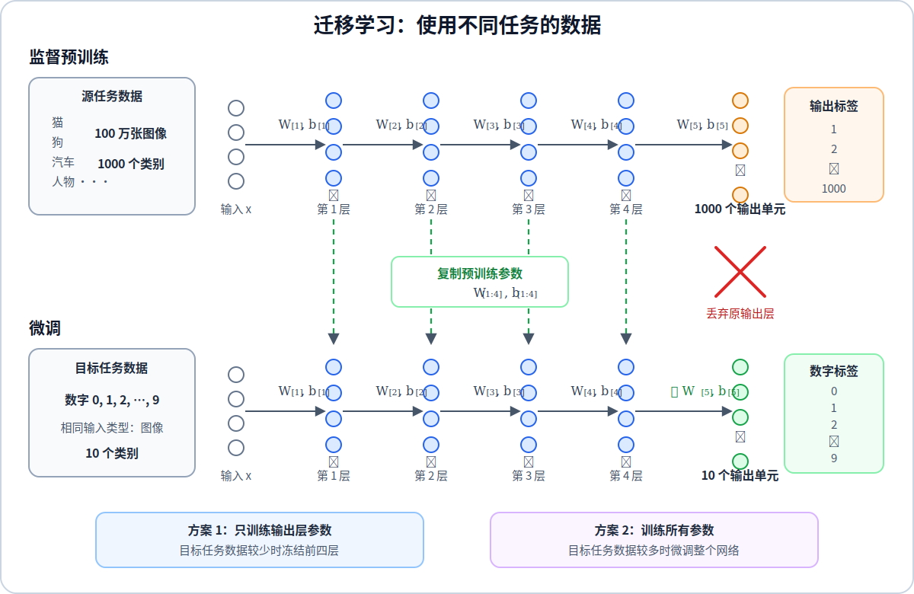
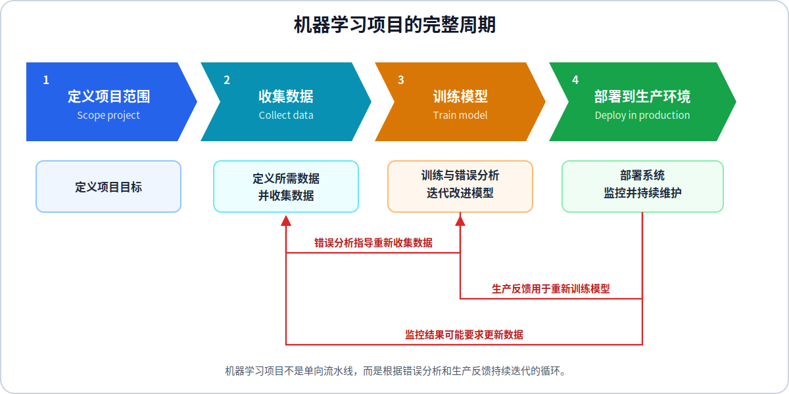
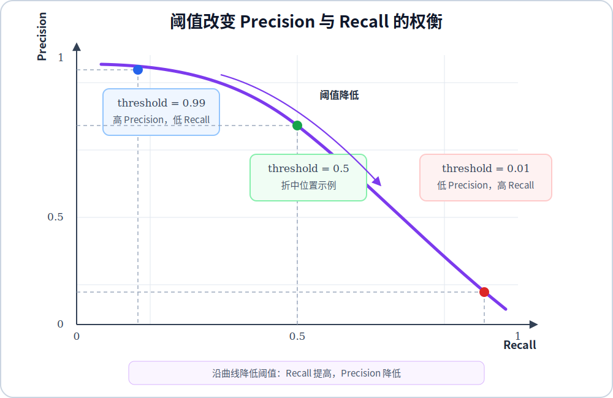

# 机器学习的开发过程

机器学习系统通常无法通过一次训练达到目标。开发的核心不是盲目尝试更多模型，而是先评估当前系统，再根据诊断结果决定下一步，把时间投入到最可能改善性能的方向。

## 1. 机器学习开发的迭代循环

课程将机器学习开发过程概括为一个反复执行的循环：

$$
\text{确定模型、数据和特征}
\longrightarrow
\text{训练模型}
\longrightarrow
\text{执行诊断}
\longrightarrow
\text{根据诊断修改系统}
$$

## 2. 错误分析

错误分析是人工检查验证集中的错误样本，并将错误按照原因分类。它可以说明模型主要在哪些类型的样本上失败，从而确定改进工作的优先级。

假设从验证集中抽取 $100$ 个错误样本，得到以下记录：

| 错误类型 | 错误样本数 | 占所检查错误的比例 |
| --- | ---: | ---: |
| 背景噪声 | 35 | $35\%$ |
| 口音 | 20 | $20\%$ |
| 距离麦克风过远 | 15 | $15\%$ |
| 标签错误 | 5 | $5\%$ |

一个样本可以同时属于多个错误类型，因此各类比例之和可以超过 $100\%$。检查样本数量不必覆盖整个验证集，但样本应足以反映主要错误模式。

错误分析还能估计某项工作的性能上限。若标签错误只占全部错误的 $5\%$，即使完全修复这类问题，最多也只能消除当前错误的 $5\%$；如果背景噪声占 $35\%$，优先改善噪声场景通常具有更大的潜在收益。

## 3. 针对性地增加数据

**增加数据并不等于收集更多任意数据。** 错误分析指出模型在哪类样本上表现差后，应优先增加该类数据。例如，模型主要在嘈杂环境中识别失败，就应收集或生成更多带真实背景噪声的训练样本。

**数据增强从已有样本生成保持标签不变的新样本。** 图像任务可以进行合理的**裁剪** 、**缩放** 、**旋转或亮度变化** ，语音任务可以叠加真实环境噪声。增强方式必须符合实际输入可能出现的变化，并且不能改变样本的真实标签。

**数据合成使用程序生成新的训练样本。** 例如，光学字符识别可以使用不同字体和背景渲染文字图像。合成数据的价值取决于它与真实数据的接近程度；如果生成规则不能覆盖真实世界的变化，模型会学习到合成过程特有的模式。

**除了增加样本，还需要提高标签一致性。** 应制定明确的标注规则，检查训练集与验证集是否采用相同标准，并修复会系统性影响模型判断的标签问题。

## 4. 迁移学习

迁移学习使用在大型数据集上训练好的模型参数，作为新任务的初始参数。源任务和目标任务通常需要处理相同类型的输入，例如都使用图像、文本或音频。

设预训练神经网络包含多个隐藏层和一个输出层。迁移到新任务时，保留隐藏层参数，替换原来的输出层，使新输出层的神经元数量与目标任务的类别数量一致。

方法1： 目标任务数据较少时，可以冻结预训练隐藏层，只训练新的输出层：

$$
\mathbf{W}^{[1]},\ldots,\mathbf{W}^{[L-1]}
\text{ 保持不变，只训练 }
\mathbf{W}^{[L]},\mathbf{b}^{[L]}
$$

方法2： 目标任务数据较多时，可以使用预训练参数初始化整个网络，再对所有层进行微调：

$$
\mathbf{W}^{[l]}
\leftarrow
\mathbf{W}_{\text{pretrained}}^{[l]},
\qquad
l=1,2,\ldots,L-1
$$

## 5. 机器学习项目的完整生命周期

完整项目从定义范围开始。首先明确系统输入、输出、使用场景、业务目标和可接受的错误，再确定能够反映目标的离线评估指标。

接下来收集和标注数据，划分训练集、验证集和测试集，建立第一个模型并进入迭代开发循环。通过偏差与方差诊断、学习曲线和错误分析决定下一步，直到验证集性能满足要求。

模型部署后，输入数据和真实环境仍会变化，因此需要持续监控模型质量、输入分布、延迟和系统资源。输入特征分布发生变化称为数据漂移；输入与目标之间的关系发生变化称为概念漂移。发现漂移后，需要更新数据、重新训练并再次完成离线和线上评估。

项目流程可以写为：

## 6. 公平性、偏见和伦理

机器学习系统不仅需要追求平均指标，还要分析系统可能造成的伤害。训练数据中的历史偏见、样本覆盖不足或标签标准不一致，都会使模型对不同群体产生不同错误率。

评估时应根据实际应用检查重要子群体的性能，不能用总体准确率掩盖某个群体上的高错误率。对于医疗、招聘、信贷和公共服务等高影响场景，还需要明确人工复核、申诉、隐私保护和数据使用边界。

开发团队需要评估系统是否会被用于不当目的、错误预测会伤害哪些人、受影响者是否知情，以及监控和纠错机制是否有效。公平性与伦理不是部署前的一次检查，而是贯穿数据收集、建模、评估、部署和维护的持续要求。

## 7. 偏斜数据集的错误指标

二分类结果可以分为四种情况：

混淆矩阵的行表示真实类别，列表示模型预测类别：

| 真实类别（行）/ 预测类别（列） | 预测为正类 | 预测为负类 |
| --- | ---: | ---: |
| 真实为正类 | True Positive（TP） | False Negative（FN） |
| 真实为负类 | False Positive（FP） | True Negative（TN） |

四种结果的具体解释：

| 真实情况与预测结果 | 含义 |
| --- | --- |
| True Positive（TP） | 真实为正类，预测为正类 |
| False Positive（FP） | 真实为负类，预测为正类 |
| False Negative（FN） | 真实为正类，预测为负类 |
| True Negative（TN） | 真实为负类，预测为负类 |

精确率表示被模型预测为正类的样本中，真实为正类的比例：

$$
\text{Precision}
=
\frac{TP}{TP+FP}
$$

召回率表示所有真实正类样本中，被模型正确发现的比例：

$$
\text{Recall}
=
\frac{TP}{TP+FN}
$$

对于 $n$ 个正数 $x_1,x_2,\ldots,x_n$，调和平均数的通式为：

$$
H_n(x_1,x_2,\ldots,x_n)
=
\left(
\frac{1}{n}
\sum_{i=1}^{n}\frac{1}{x_i}
\right)^{-1}
=
\frac{n}
{\displaystyle\sum_{i=1}^{n}\frac{1}{x_i}}
$$

当精确率和召回率都需要考虑时，可以使用二者的调和平均数，也就是 $F_1$ 分数。令

$$
P=\text{Precision},
\qquad
R=\text{Recall}
$$

把 $P$ 和 $R$ 代入 $n=2$ 时的调和平均数：

$$
\begin{aligned}
F_1
&=
\left[
\frac{1}{2}
\left(
\frac{1}{P}+\frac{1}{R}
\right)
\right]^{-1}\\
&=
\left(
\frac{P+R}{2PR}
\right)^{-1}\\
&=
\frac{2PR}{P+R}
\end{aligned}
$$

$F_1$ 不是精确率和召回率的算术平均数。调和平均数会更重地惩罚较小的一项，因此精确率或召回率中任意一项很低，$F_1$ 都会明显下降。

### 精确率与召回率的权衡

二分类模型通常根据阈值决定预测类别：

$$
\hat{y}
=
\begin{cases}
1, & f_{\mathbf{w},b}(\mathbf{x})\ge t\\
0, & f_{\mathbf{w},b}(\mathbf{x})<t
\end{cases}
$$

**提高阈值 $t$ 后，精确率通常提高，召回率通常下降。** 模型只在更有把握时预测正类，假阳性通常减少，但更多真实正类会被漏掉。

**降低阈值 $t$ 后，召回率通常提高，精确率通常下降。** 模型更容易预测正类，能够发现更多真实正类，但假阳性也会增加。

