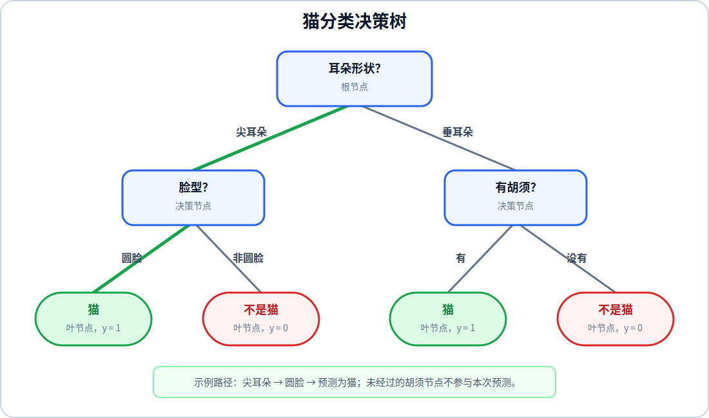

# 决策树

决策树是一种监督学习模型，通过连续提出关于输入特征的问题，将样本逐步划分到不同分支，最终在叶节点给出预测。决策树可以用于分类和回归；本篇先按照课程中的猫分类示例讲解分类树。

## 1. 决策树模型

假设需要根据动物的三个特征判断它是不是猫：

- 耳朵形状：尖耳朵或垂耳朵
- 脸型：圆脸或非圆脸
- 是否有胡须

一棵决策树可以先检查耳朵形状，再根据不同分支检查脸型或胡须：

树顶部的第一个节点称为根节点。包含特征判断的节点称为决策节点，从节点出发的连线称为分支，给出最终预测的节点称为叶节点。

决策树的每个叶节点都对应一条从根节点开始的规则。例如：

$$
\text{尖耳朵}
\land
\text{圆脸}
\longrightarrow
\text{预测为猫}
$$

## 2. 决策树的预测与学习

### 使用决策树进行预测

对一个新样本进行预测时，从根节点开始，根据样本的特征选择分支，直到到达叶节点。

不同样本可以经过不同的决策节点，这也是决策树能够把复杂分类规则拆成多个简单条件的原因。

### 决策树的学习过程

决策树采用递归方式学习：

1. 在当前节点比较所有候选特征。
2. 选择使数据纯度提升最多的特征进行划分。
3. 将训练样本分配到不同子节点。
4. 在每个子节点上重复相同过程，直到满足停止条件。

这个过程在每个节点选择当前最优划分，因此属于贪心算法。它不能保证得到所有可能树结构中的全局最优树，但计算效率高，并且在实践中有效。

## 3. 熵与纯度

纯度表示一个节点中的样本是否主要属于同一个类别。节点中的样本全部属于同一类别时，节点是纯的；正类和负类数量接近时，节点最不纯。

设节点中正类样本所占比例为 $p_1$，二分类熵定义为：

$$
H(p_1)
=
-p_1\log_2(p_1)
-
(1-p_1)\log_2(1-p_1)
$$

当概率为 $0$ 时，约定 $0\log_2(0)=0$。熵的典型取值为：

| 正类比例 $p_1$ | 熵 $H(p_1)$ | 节点状态 |
| ---: | ---: | --- |
| $0$ | $0$ | 全部为负类，完全纯 |
| $0.5$ | $1$ | 正负类别各占一半，最不纯 |
| $1$ | $0$ | 全部为正类，完全纯 |

熵越低，节点越纯；熵越高，类别越混杂。决策树希望每次划分后，子节点的加权平均熵低于父节点的熵。

## 4. 信息增益

信息增益衡量一次划分使熵降低了多少。设当前节点包含 $m$ 个样本，左子节点包含 $m_{\text{left}}$ 个样本，右子节点包含 $m_{\text{right}}$ 个样本：

$$
w_{\text{left}}
=
\frac{m_{\text{left}}}{m},
\qquad
w_{\text{right}}
=
\frac{m_{\text{right}}}{m}
$$

设当前节点、左子节点和右子节点的正类比例分别为 $p_1^{\text{root}}$、$p_1^{\text{left}}$ 和 $p_1^{\text{right}}$，信息增益为：

$$
\begin{aligned}
\text{Information Gain}
&=
H\left(p_1^{\text{root}}\right)\\
&\quad-
\left[
w_{\text{left}}H\left(p_1^{\text{left}}\right)
+
w_{\text{right}}H\left(p_1^{\text{right}}\right)
\right]
\end{aligned}
$$

这里的 root 表示当前正在划分的节点，不一定是整棵树最顶部的根节点。

课程的猫分类示例包含 $10$ 个样本，其中 $5$ 个是猫，当前节点的熵为：

$$
H(0.5)=1
$$

按照耳朵形状划分后，左右子节点各包含 $5$ 个样本，猫的比例分别为 $0.8$ 和 $0.2$：

$$
\begin{aligned}
\text{Information Gain}_{\text{ear}}
&=
1
-
\left[
\frac{5}{10}H(0.8)
+
\frac{5}{10}H(0.2)
\right]\\
&=
1-0.72\\
&=
0.28
\end{aligned}
$$

课程示例中三个候选特征的信息增益为：

| 候选特征 | 信息增益 |
| --- | ---: |
| 耳朵形状 | $0.28$ |
| 胡须 | $0.12$ |
| 脸型 | $0.03$ |

耳朵形状的信息增益最大，因此选择它作为根节点的划分特征。

### 连续值特征的阈值选择

前面的耳朵形状、脸型和胡须都是离散特征。动物体重、身高和年龄等特征可以取许多不同数值，属于连续值特征。对于连续值特征，决策树需要同时选择**用于划分的特征**和**划分阈值**。

假设当前节点使用体重 $x$ 进行划分，给定阈值 $t$ 后，样本被分为两组：

$$
\begin{aligned}
\text{左子节点}&:\quad x\leq t\\
\text{右子节点}&:\quad x>t
\end{aligned}
$$

寻找阈值时，先将当前节点中该特征的不同取值从小到大排列：

$$
v_1<v_2<\cdots<v_q
$$

相邻取值的中点可以作为候选阈值：

$$
t_j
=
\frac{v_j+v_{j+1}}{2},
\qquad
j=1,2,\ldots,q-1
$$

对于每个候选阈值，按照 $x\leq t_j$ 和 $x>t_j$ 划分样本，再计算信息增益。使信息增益最大的阈值，就是当前连续特征在该节点上的最佳划分阈值。

例如，训练样本的体重依次为 $4,6,7,8,10,12$，前三个样本是猫，后三个样本不是猫。候选阈值 $7.5$ 可以得到：

$$
\begin{aligned}
x\leq 7.5&:\quad 3\text{ 只猫，}0\text{ 只非猫}\\
x>7.5&:\quad 0\text{ 只猫，}3\text{ 只非猫}
\end{aligned}
$$

两个子节点的熵都为 $0$，父节点的熵为 $1$，因此该阈值的信息增益为：

$$
\text{Information Gain}
=
1
-
\left[
\frac{3}{6}H(1)
+
\frac{3}{6}H(0)
\right]
=
1
$$

如果有多个连续特征，需要分别寻找每个特征的最佳阈值，再把这些划分与离散特征的候选划分一起比较，最终选择信息增益最大的“特征与阈值”组合。递归进入子节点后，应使用该子节点中的样本重新寻找阈值；同一个连续特征也可以在树的不同节点再次参与划分。

## 5. 完整的建树算法

从所有训练样本组成的根节点开始，计算每个可用特征的信息增益，选择信息增益最大的特征进行划分。对于产生的每个子节点，使用分配到该节点的样本重新计算候选特征的信息增益，并递归构建子树。

递归过程在以下情况停止：

- 节点中的样本已经全部属于同一类别
- 没有剩余特征可以继续划分
- 树已经达到预先设定的最大深度
- 信息增益低于设定阈值
- 子节点包含的样本数量过少

停止后，将当前节点设为叶节点，并使用节点中数量最多的类别作为预测结果。

限制最大深度、最小叶节点样本数或最小信息增益，可以减少树对训练数据细节的过度拟合。树太浅时容易产生高偏差，树太深时容易产生高方差。
