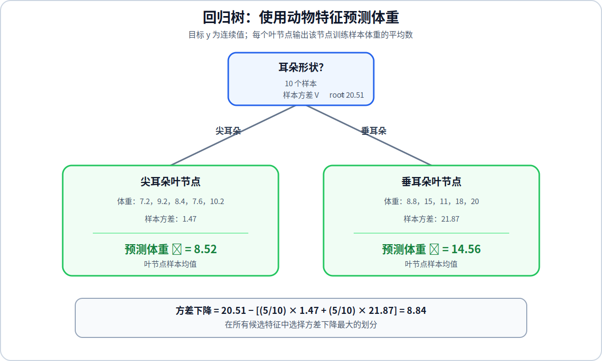

# 回归树

分类树预测离散类别，回归树预测连续数值。两者的树结构和递归建树过程相同，主要区别是：分类树使用熵衡量节点纯度，回归树使用节点内目标值 $y$ 的方差衡量数据的离散程度。

## 1. 叶节点的预测值

一个样本到达叶节点后，回归树输出该叶节点中所有训练样本目标值的平均数。设叶节点中有 $m$ 个样本，它的预测值为：

$$
\hat{y}
=
\bar{y}
=
\frac{1}{m}
\sum_{i=1}^{m}y^{(i)}
$$

使用均值作为预测值，可以使叶节点内的平方误差和达到最小。

## 2. 使用方差衡量节点质量

设一个节点中的目标值为 $y^{(1)},y^{(2)},\ldots,y^{(m)}$，课程示例使用样本方差：

$$
V
=
\frac{1}{m-1}
\sum_{i=1}^{m}
\left(y^{(i)}-\bar{y}\right)^2
$$

目标值越接近，方差越小；目标值差异越大，方差越大。当节点中只有一个样本时，可以将该节点的方差记为 $0$。

一些决策树实现使用除以 $m$ 的均方偏差衡量节点误差。无论采用哪一种定义，核心过程都是比较划分前后的加权离散程度，并在所有候选划分中保持同一计算标准。

## 3. 使用方差下降选择划分

分类树选择信息增益最大的特征，回归树则选择方差下降最大的特征。设当前节点、左子节点和右子节点的方差分别为 $V_{\text{root}}$、$V_{\text{left}}$ 和 $V_{\text{right}}$，方差下降为：

$$
\begin{aligned}
\text{Variance Reduction}
&=
V_{\text{root}}\\
&\quad-
\left[
w_{\text{left}}V_{\text{left}}
+
w_{\text{right}}V_{\text{right}}
\right]
\end{aligned}
$$

其中：

$$
w_{\text{left}}
=
\frac{m_{\text{left}}}{m},
\qquad
w_{\text{right}}
=
\frac{m_{\text{right}}}{m}
$$

方差下降越大，说明划分后的两个子节点内部越集中，因此该划分越好。

## 4. 课程中的体重示例

当前节点包含 $10$ 个动物，体重为：

$$
7.2,\ 8.8,\ 15,\ 9.2,\ 8.4,\ 7.6,\ 11,\ 18,\ 10.2,\ 20
$$

这些体重的样本方差为 $20.51$。按照耳朵形状划分后，两个子节点各有 $5$ 个样本：

| 耳朵形状 | 子节点中的体重 | 均值 | 样本方差 |
| --- | --- | ---: | ---: |
| 尖耳朵 | $7.2,\ 9.2,\ 8.4,\ 7.6,\ 10.2$ | $8.52$ | $1.47$ |
| 垂耳朵 | $8.8,\ 15,\ 11,\ 18,\ 20$ | $14.56$ | $21.87$ |

按照耳朵形状划分得到的方差下降为：

$$
\begin{aligned}
\text{Variance Reduction}_{\text{ear}}
&=
20.51
-
\left[
\frac{5}{10}\times1.47
+
\frac{5}{10}\times21.87
\right]\\
&=
8.84
\end{aligned}
$$

课程示例中三个候选特征的方差下降为：

| 候选特征 | 方差下降 |
| --- | ---: |
| 耳朵形状 | $8.84$ |
| 脸型 | $0.64$ |
| 胡须 | $6.22$ |

耳朵形状带来的方差下降最大，因此选择它作为当前节点的划分特征。如果在这一层停止生长，尖耳朵叶节点预测体重 $8.52$，垂耳朵叶节点预测体重 $14.56$。

## 5. 回归树的学习过程

回归树从根节点开始，计算每个候选特征或“连续特征与阈值”组合带来的方差下降，选择方差下降最大的划分，再对子节点递归执行相同过程。达到最大深度、样本数过少或方差下降低于阈值时停止划分，并将当前节点内目标值的平均数作为叶节点输出。
