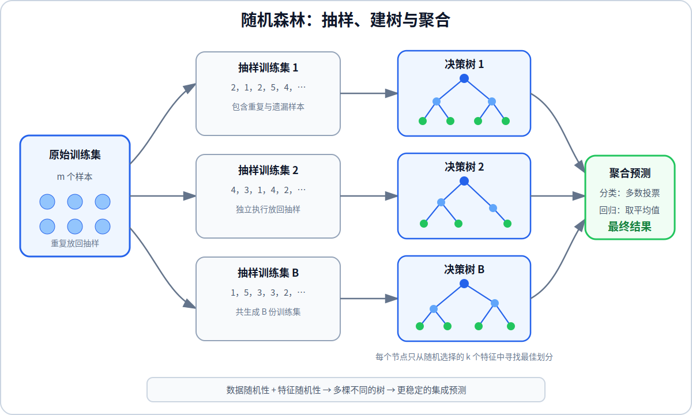

# 随机森林

单棵决策树容易受到训练数据中少量变化的影响：训练集稍有不同，根节点和后续分支就可能完全改变。树集成通过训练多棵不同的决策树并汇总它们的预测，降低单棵树带来的高方差。

## 1. 使用多棵决策树

假设训练了 $B$ 棵决策树，第 $b$ 棵树的预测记为 $f_b(\mathbf{x})$。对于分类问题，所有树分别进行预测，最终选择得票最多的类别：

$$
\hat{y}
=
\operatorname{mode}
\left(
f_1(\mathbf{x}),
f_2(\mathbf{x}),
\ldots,
f_B(\mathbf{x})
\right)
$$

对于回归问题，最终预测是所有树预测值的平均数：

$$
\hat{y}
=
\frac{1}{B}
\sum_{b=1}^{B}
f_b(\mathbf{x})
$$

如果每棵树都使用完全相同的数据和算法进行训练，它们通常会得到相同或高度相似的结构，因此需要为每棵树构造不同的训练数据。

## 2. 放回抽样

设原始训练集包含 $m$ 个样本。放回抽样每次从原始训练集中随机取出一个样本，记录后再将它放回，因此同一个样本可以被重复抽到。

连续抽取 $m$ 次可以得到一个新的训练集。新训练集仍包含 $m$ 个样本，但其中可能有重复样本，也会有部分原始样本没有被抽到。重复执行这个过程，就能为不同的决策树生成不同的训练集。

例如，原始训练集的样本编号为：

$$
1,\ 2,\ 3,\ 4,\ 5
$$

一次放回抽样得到的训练集可以是：

$$
2,\ 1,\ 2,\ 5,\ 4
$$

样本 $2$ 被抽到两次，样本 $3$ 没有被抽到，这正是不同树获得差异的来源。

## 3. Bagging 决策树

Bagging 是 Bootstrap Aggregating 的缩写。训练第 $b$ 棵树时，先通过放回抽样生成第 $b$ 个训练集，再使用该训练集训练一棵决策树；重复 $B$ 次后，通过多数投票或平均值聚合所有树的结果。

Bagging 决策树的每个节点仍会检查全部 $n$ 个特征，并从中选择信息增益或方差下降最大的划分。不同树之间的差异只来自各自的放回抽样训练集。

## 4. 随机森林算法

随机森林在 Bagging 的基础上进一步随机化特征。训练一棵树的每个节点时，不再检查全部 $n$ 个特征，而是随机选择其中 $k$ 个特征，只在这 $k$ 个候选特征中寻找最佳划分。

课程给出的常用选择是：

$$
k
\approx
\sqrt{n}
$$

每到一个新节点，都要重新随机选择一个特征子集。这样可以降低多棵树反复选择同一个强特征的概率，使树之间的结构更加多样。

完整过程是：为每棵树生成一个包含 $m$ 个样本的放回抽样训练集；从根节点开始，在每个节点随机选择 $k$ 个候选特征并找出最佳划分；重复训练 $B$ 棵树；分类时进行多数投票，回归时计算平均值。

课程指出，$B$ 通常可以取约 $100$。增加树的数量一般不会使训练集拟合变差，但超过一定数量后改进会逐渐减小，同时训练和预测所需的计算量会继续增加。

## 5. Bagging 与随机森林的区别

| 方法 | 每棵树使用的数据 | 每个节点检查的特征 |
| --- | --- | --- |
| 单棵决策树 | 完整训练集 | 全部 $n$ 个特征 |
| Bagging 决策树 | 独立的放回抽样训练集 | 全部 $n$ 个特征 |
| 随机森林 | 独立的放回抽样训练集 | 随机选择的 $k$ 个特征 |

放回抽样带来数据差异，随机特征子集进一步降低树之间的相关性。多棵不完全相同的树共同投票或取平均后，个别树的错误会被削弱，因此随机森林通常比单棵决策树更稳定，并且对训练数据的小幅变化不那么敏感。
