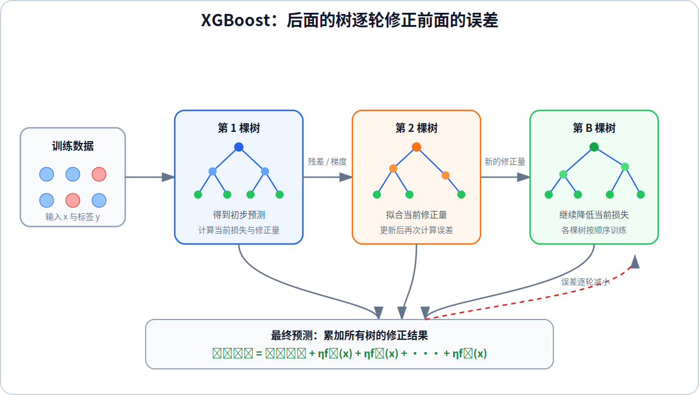

# XGBoost

XGBoost 是 Extreme Gradient Boosting 的缩写，它属于提升树方法。随机森林并行训练许多相互独立的树，再进行投票或取平均；XGBoost 按顺序训练树，后面的树专门修正当前模型仍然存在的预测误差。



## 1. Boosting 的基本思想

先训练第一棵决策树并检查它的预测结果，再让下一棵树更加关注当前模型预测不好的样本。课程使用“提高错误样本的重要性”来解释 Boosting：一个样本被前面的树错误预测后，后续树会更关注这个样本。

这是一种直观解释。XGBoost 的实际实现不是简单地重复抽取错误样本，而是根据损失函数的梯度计算每个样本还需要修正的方向和幅度，再训练下一棵树拟合这些修正量。

假设第 $b$ 棵树为 $f_b(\mathbf{x})$，模型经过 $B$ 轮后的预测为：

$$
\hat{y}^{(B)}
=
\hat{y}^{(0)}
+
\sum_{b=1}^{B}
\eta f_b(\mathbf{x})
$$

其中 $\hat{y}^{(0)}$ 是初始预测，$\eta$ 是学习率。学习率控制每棵新树对最终结果的影响；$\eta$ 越小，单棵树的修正越谨慎，通常需要训练更多树。

## 2. 逐轮修正误差

对于使用平方误差的回归问题，当前模型对第 $i$ 个样本的残差为：

$$
r_i^{(b)}
=
y^{(i)}
-
\hat{y}_i^{(b-1)}
$$

第 $b$ 棵树学习从输入 $\mathbf{x}^{(i)}$ 到残差 $r_i^{(b)}$ 的映射，再将这棵树的输出乘以学习率并加入当前预测：

$$
\hat{y}_i^{(b)}
=
\hat{y}_i^{(b-1)}
+
\eta f_b\left(\mathbf{x}^{(i)}\right)
$$

对于分类问题，修正目标不再直接等于 $y-\hat{y}$，而是由分类损失函数对当前预测的梯度决定。无论任务类型如何，每一轮都在当前模型的基础上继续降低损失，因此各棵树必须按顺序训练。

## 3. XGBoost 的目标函数

训练第 $b$ 棵树时，XGBoost 同时考虑预测损失和树的复杂度：

$$
\mathcal{J}^{(b)}
=
\sum_{i=1}^{m}
L
\left(
y^{(i)},
\hat{y}_i^{(b-1)}
+
f_b\left(\mathbf{x}^{(i)}\right)
\right)
+
\Omega(f_b)
$$

常用的树复杂度惩罚为：

$$
\Omega(f)
=
\gamma T
+
\frac{\lambda}{2}
\sum_{j=1}^{T}w_j^2
$$

其中 $T$ 是叶节点数量，$w_j$ 是第 $j$ 个叶节点的输出值，$\gamma$ 控制增加叶节点的代价，$\lambda$ 控制叶节点输出的正则化强度。这个目标函数使模型在降低训练损失的同时限制树的复杂度。

XGBoost 还使用损失函数的一阶和二阶导数高效评估候选划分，并提供正则化、缺失值处理、并行计算划分等工程优化。它训练的是一组顺序相加的树，而不是通过多数投票组合相互独立的树。

## 4. Python 示例

分类任务可以使用 `XGBClassifier`：

```python
import numpy as np
from xgboost import XGBClassifier

# 每行包含一个样本的两个输入特征。
X_train = np.array(
    [
        [1.0, 2.0],
        [1.5, 1.8],
        [3.0, 3.5],
        [3.5, 4.0],
    ],
    dtype=np.float32,
)
y_train = np.array([0, 0, 1, 1], dtype=np.int64)

model = XGBClassifier(
    n_estimators=100,      # 顺序训练的树数量
    learning_rate=0.1,     # 每棵新树加入模型时的缩放系数
    max_depth=3,           # 单棵树的最大深度
    subsample=0.8,         # 每轮训练使用的样本比例
    colsample_bytree=0.8,  # 每棵树使用的特征比例
    reg_lambda=1.0,        # 叶节点输出的 L2 正则化系数
    eval_metric="logloss",
    random_state=0,
)

model.fit(X_train, y_train)
prediction = model.predict(
    np.array([[2.8, 3.2]], dtype=np.float32)
)
```

回归任务使用相同的训练接口，只需将模型替换为 `XGBRegressor`，并把标签改为连续值：

```python
from xgboost import XGBRegressor

y_weight = np.array([7.2, 8.8, 15.0, 18.0], dtype=np.float32)

model = XGBRegressor(
    n_estimators=100,
    learning_rate=0.1,
    max_depth=3,
    objective="reg:squarederror",
    random_state=0,
)

model.fit(X_train, y_weight)
prediction = model.predict(
    np.array([[2.8, 3.2]], dtype=np.float32)
)
```

`n_estimators` 与 `learning_rate` 需要共同考虑：减小学习率时通常需要增加树的数量；`max_depth` 过大则会提高单棵树的复杂度和过拟合风险。

## 5. XGBoost 与随机森林

| 对比项 | 随机森林 | XGBoost |
| --- | --- | --- |
| 树的训练方式 | 多棵树相互独立，可以并行训练 | 后一棵树依赖当前模型，必须逐轮训练 |
| 树之间的差异 | 放回抽样和随机特征子集 | 每棵树拟合当前损失的修正量 |
| 结果组合 | 分类投票，回归取平均 | 将各棵树的输出按学习率累加 |
| 主要作用 | 通过平均降低方差 | 逐步降低偏差和训练损失 |

随机森林的每棵树独立解决完整任务，XGBoost 的每棵新树只负责修正当前模型尚未处理好的部分，这就是 Bagging 与 Boosting 的核心区别。
