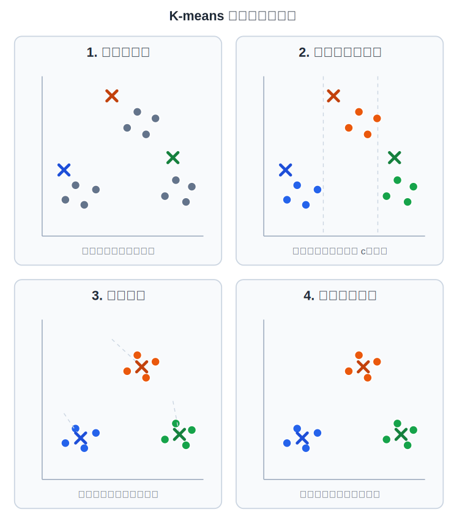
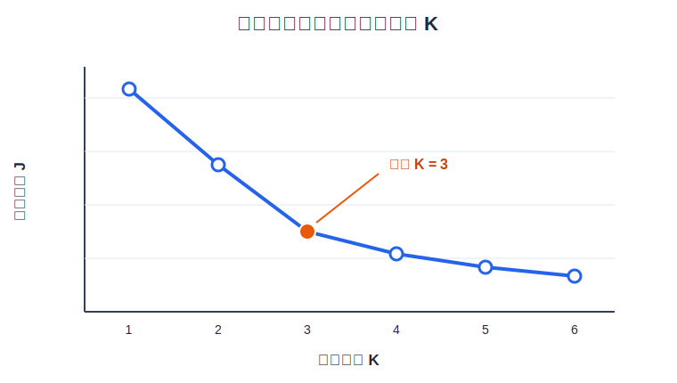

# K-means 聚类

K-means 是一种无监督学习算法，它根据样本之间的相似程度自动发现数据中的分组。算法不使用类别标签，而是把每个样本分配给距离最近的质心，再根据簇内样本更新质心。

## 1. 聚类问题

监督学习的训练数据同时包含输入 $\mathbf{x}^{(i)}$ 和目标 $y^{(i)}$，聚类数据只包含输入：

$$
\left\{
\mathbf{x}^{(1)},
\mathbf{x}^{(2)},
\ldots,
\mathbf{x}^{(m)}
\right\}
$$

聚类算法需要从这些无标签样本中找出数据自身的结构。例如，将客户按照行为分组、将新闻按照主题分组，或者在图像压缩中把相近颜色归为同一组。

K-means 中的 $K$ 表示预先指定的簇数量。每个簇由一个质心表示，质心是一个与样本特征维度相同的向量：

$$
\boldsymbol{\mu}_1,
\boldsymbol{\mu}_2,
\ldots,
\boldsymbol{\mu}_K
$$

## 2. K-means 直觉

给定 $K$ 个初始质心后，K-means 重复执行两个步骤：

1. 将每个样本分配给距离最近的质心。
2. 将每个质心移动到所属簇全部样本的平均位置。



图中的圆点表示训练样本，叉号表示质心。第一次分配完成后，每个样本获得一个簇索引；更新质心后，再根据新的质心重新分配样本。两个步骤交替执行，直到簇分配不再改变或质心移动量低于设定阈值。

## 3. K-means 算法

设第 $i$ 个样本的簇索引为 $c^{(i)}$，其取值范围为 $1,2,\ldots,K$。

### 簇分配

对每个样本 $\mathbf{x}^{(i)}$，计算它到所有质心的平方欧氏距离，并选择距离最小的质心：

$$
c^{(i)}
=
\underset{k\in\{1,\ldots,K\}}{\arg\min}
\left\|
\mathbf{x}^{(i)}-\boldsymbol{\mu}_k
\right\|_2^2
$$

使用平方距离不会改变最近质心的选择，同时避免计算平方根。

### 更新质心

完成簇分配后，第 $k$ 个质心更新为该簇全部样本的均值：

$$
\boldsymbol{\mu}_k
=
\frac{
\displaystyle\sum_{i=1}^{m}
\mathbb{1}\left\{c^{(i)}=k\right\}\mathbf{x}^{(i)}
}{
\displaystyle\sum_{i=1}^{m}
\mathbb{1}\left\{c^{(i)}=k\right\}
}
$$

其中 $\mathbb{1}\{\cdot\}$ 是指示函数，条件成立时取 $1$，否则取 $0$。如果某个簇没有分配到样本，上式分母为 $0$；实际实现必须明确处理空簇，本篇代码保留该簇上一轮的质心。

完整算法为：

1. 初始化 $K$ 个质心。
2. 根据当前质心计算所有 $c^{(i)}$。
3. 根据当前簇分配更新所有 $\boldsymbol{\mu}_k$。
4. 如果质心已经收敛则停止，否则返回第 2 步。

## 4. 优化目标

K-means 的失真代价函数为：

$$
J\left(
c^{(1)},\ldots,c^{(m)},
\boldsymbol{\mu}_1,\ldots,\boldsymbol{\mu}_K
\right)
=
\frac{1}{m}
\sum_{i=1}^{m}
\left\|
\mathbf{x}^{(i)}
-
\boldsymbol{\mu}_{c^{(i)}}
\right\|_2^2
$$

簇分配步骤固定质心并为每个样本选择最近质心，因此不会增大 $J$；质心更新步骤固定簇分配并使用簇内均值，而均值是平方误差和的最小点，因此也不会增大 $J$。每轮迭代后的代价单调不增，算法最终收敛。

K-means 的目标函数不是凸函数，不同初始质心会得到不同的局部最优结果，因此收敛不等于得到全局最优结果。

## 5. 随机初始化

当 $K\leq m$ 时，课程给出的初始化方法是从训练集中随机选择 $K$ 个不同样本作为初始质心：

$$
\left\{
\boldsymbol{\mu}_1,\ldots,\boldsymbol{\mu}_K
\right\}
\subseteq
\left\{
\mathbf{x}^{(1)},\ldots,\mathbf{x}^{(m)}
\right\}
$$

为了降低单次随机初始化落入较差局部最优解的影响，应多次运行 K-means，每次使用不同的初始质心，最后选择代价 $J$ 最小的结果：

$$
r^*
=
\underset{r\in\{1,\ldots,R\}}{\arg\min}
J^{(r)}
$$

其中 $R$ 是随机初始化次数。课程建议在 $K$ 较小时进行多次随机初始化；如果只运行一次，结果直接依赖那一次随机选择。

## 6. 选择聚类数量

$K$ 不是由基础 K-means 算法自动学习的参数。选择 $K$ 时，应首先考虑聚类结果的实际用途。例如，服装尺码划分为三组还是五组，取决于生产成本、库存管理和用户需求，而不是只取决于数据形状。

肘部法则会对多个 $K$ 分别运行 K-means，并绘制 $K$ 与最终代价 $J$ 的关系：



随着 $K$ 增大，每个样本可以分配到更近的质心，因此训练代价不会上升。如果曲线在某个位置从快速下降转为缓慢下降，该位置称为肘点，图中对应 $K=3$。

肘部法则不是通用的唯一判据。曲线没有清晰肘点时，不能从曲线确定唯一的 $K$；此时必须结合下游任务目标和聚类结果的可解释性进行选择。

## 7. NumPy 完整实现

下面的实现只依赖 NumPy，包含簇分配、质心更新、代价计算、收敛判断、多次随机初始化和新样本预测：

```python
import numpy as np


def assign_clusters(X, centroids):
    distance_squared = np.sum(
        (X[:, np.newaxis, :] - centroids[np.newaxis, :, :]) ** 2,
        axis=2,
    )
    return np.argmin(distance_squared, axis=1)


def update_centroids(X, cluster_indices, centroids):
    new_centroids = centroids.copy()
    for k in range(centroids.shape[0]):
        cluster_points = X[cluster_indices == k]
        if cluster_points.shape[0] > 0:
            new_centroids[k] = np.mean(cluster_points, axis=0)
    return new_centroids


def compute_cost(X, cluster_indices, centroids):
    errors = X - centroids[cluster_indices]
    return np.mean(np.sum(errors**2, axis=1))


def run_kmeans(X, initial_centroids, max_iterations=100, tolerance=1e-6):
    centroids = initial_centroids.copy()

    for _ in range(max_iterations):
        cluster_indices = assign_clusters(X, centroids)
        new_centroids = update_centroids(X, cluster_indices, centroids)

        if np.max(np.linalg.norm(new_centroids - centroids, axis=1)) <= tolerance:
            centroids = new_centroids
            break

        centroids = new_centroids

    cluster_indices = assign_clusters(X, centroids)
    cost = compute_cost(X, cluster_indices, centroids)
    return centroids, cluster_indices, cost


def fit_kmeans(X, K, n_init=20, random_state=0):
    if K < 1 or K > X.shape[0]:
        raise ValueError("K 必须满足 1 <= K <= 样本数量")
    if n_init < 1:
        raise ValueError("n_init 必须大于等于 1")

    random_generator = np.random.default_rng(random_state)
    best_result = None

    for _ in range(n_init):
        initial_indices = random_generator.choice(
            X.shape[0],
            size=K,
            replace=False,
        )
        result = run_kmeans(X, X[initial_indices])

        if best_result is None or result[2] < best_result[2]:
            best_result = result

    return best_result


def predict(X, centroids):
    return assign_clusters(X, centroids)


X_train = np.array(
    [
        [1.0, 1.0],
        [1.2, 1.8],
        [1.8, 1.2],
        [2.0, 2.0],
        [5.0, 7.8],
        [5.8, 8.5],
        [6.4, 7.6],
        [6.8, 8.6],
        [8.0, 1.0],
        [8.6, 1.8],
        [9.0, 1.1],
        [9.4, 2.0],
    ],
    dtype=np.float64,
)

centroids, cluster_indices, cost = fit_kmeans(
    X_train,
    K=3,
    n_init=20,
    random_state=0,
)

X_new = np.array([[1.5, 1.4], [8.8, 1.5]], dtype=np.float64)

print("质心：")
print(np.round(centroids, 2))
print("训练代价：", round(cost, 4))
print("新样本所属簇：", predict(X_new, centroids))
```

预期输出：

```text
质心：
[[6.   8.12]
 [8.75 1.48]
 [1.5  1.5 ]]
训练代价： 0.4804
新样本所属簇： [2 1]
```

固定随机种子后，每次运行会得到一致结果。簇索引只用于区分簇，本身没有大小和先后含义；不同初始化即使得到相同分组，簇编号也可以不同。

## 参考资料

- [吴恩达 Machine Learning Specialization：Unsupervised Learning, Recommenders, Reinforcement Learning](https://www.coursera.org/learn/unsupervised-learning-recommenders-reinforcement-learning)
