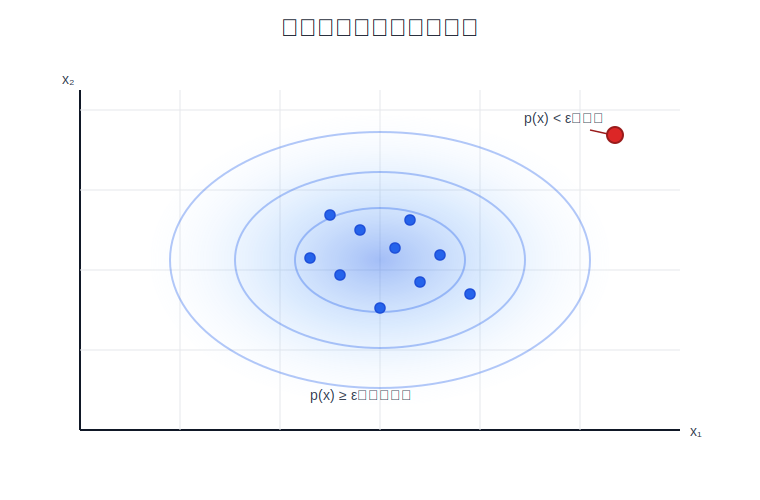
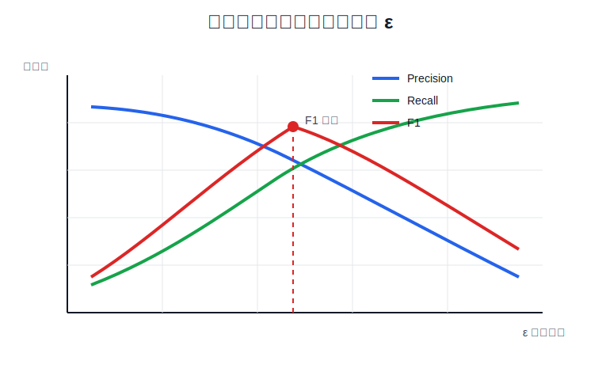

# 异常检测算法

异常检测用于从大量正常样本中找出少量异常样本。训练数据通常只包含输入特征 $\mathbf{x}^{(i)}$，不把异常类别作为主要训练目标，因此它属于无监督学习中的典型问题。

## 1. 异常检测问题

设训练集为：

$$
\left\{
\mathbf{x}^{(1)},
\mathbf{x}^{(2)},
\ldots,
\mathbf{x}^{(m)}
\right\}
$$

每个样本 $\mathbf{x}^{(i)}\in\mathbb{R}^n$ 包含 $n$ 个特征。异常检测的核心思想是先学习正常样本的概率分布 $p(\mathbf{x})$，再用概率大小判断新样本是否异常：

$$
p(\mathbf{x}_{\text{test}})<\epsilon
\quad\Rightarrow\quad
\text{anomaly}
$$

$$
p(\mathbf{x}_{\text{test}})\ge\epsilon
\quad\Rightarrow\quad
\text{normal}
$$

其中 $\epsilon$ 是阈值。样本在训练分布下的概率越低，说明它越不符合正常数据规律。



图中蓝色区域表示正常样本的高密度区域，红色点位于低概率区域，因此会被判定为异常。

## 2. 高斯分布

单个特征 $x$ 可以用高斯分布建模：

$$
p(x;\mu,\sigma^2)
=
\frac{1}{\sqrt{2\pi}\sigma}
\exp\left(
-\frac{(x-\mu)^2}{2\sigma^2}
\right)
$$

其中 $\mu$ 是均值，$\sigma^2$ 是方差：

$$
\mu
=
\mathbb{E}[X]
$$

$$
\sigma^2
=
\mathbb{E}\left[(X-\mu)^2\right]
$$

$\mu$ 控制分布中心，$\sigma^2$ 控制分布宽度；方差越大，分布越分散。这个模型不要求原始特征严格服从高斯分布；如果特征分布明显偏斜，可以先使用 $\log(x+c)$、$\sqrt{x}$ 等变换，让正常样本的分布更接近钟形。

## 3. 密度估计

对每个特征 $j$，使用训练集估计均值和方差：

$$
\mu_j
=
\frac{1}{m}
\sum_{i=1}^{m}x_j^{(i)}
$$

$$
\sigma_j^2
=
\frac{1}{m}
\sum_{i=1}^{m}
\left(x_j^{(i)}-\mu_j\right)^2
$$

如果特征数量为 $n$，并且使用独立特征假设，则联合概率密度写为各个特征概率密度的乘积：

$$
p(\mathbf{x})
=
\prod_{j=1}^{n}
p(x_j;\mu_j,\sigma_j^2)
$$

训练过程只需要计算每个特征的 $\mu_j$ 和 $\sigma_j^2$，不需要梯度下降。得到参数后，对任意新样本计算联合概率密度 $p(\mathbf{x})$，再与阈值 $\epsilon$ 比较。

完整流程为：

1. 选择能反映异常行为的特征。
2. 用正常训练样本估计每个特征的 $\mu_j$ 和 $\sigma_j^2$。
3. 在验证集上计算每个样本的 $p(\mathbf{x})$。
4. 选择能获得较好评估指标的阈值 $\epsilon$。
5. 对新样本计算 $p(\mathbf{x})$ 并判断是否异常。

## 4. 阈值选择和评估

课程中的数据拆分思路是：训练集只放正常样本，用来拟合正常数据的密度模型；交叉验证集和测试集带有标签，里面包含正常样本和少量异常样本，用来选择阈值 $\epsilon$ 和评估最终效果。

例如一共有 $6000$ 个正常样本和少量异常样本时，可以把 $6000$ 个正常样本放入训练集，用这些样本估计 $\mu_j$ 和 $\sigma_j^2$，得到 $p(\mathbf{x})$。然后把一部分正常样本和异常样本组成交叉验证集，在交叉验证集上尝试多个 $\epsilon$，选择 $F_1$ 分数最高的阈值。最后使用测试集评估选定阈值下的泛化效果。


二分类预测规则为：

$$
\hat{y}=
\begin{cases}
1, & p(\mathbf{x})<\epsilon\\
0, & p(\mathbf{x})\ge\epsilon
\end{cases}
$$

其中 $1$ 表示异常，$0$ 表示正常。异常样本通常很少，只看准确率会掩盖漏检问题，因此更常用精确率、召回率和 $F_1$ 分数：

$$
\text{precision}
=
\frac{TP}{TP+FP}
$$

$$
\text{recall}
=
\frac{TP}{TP+FN}
$$

$$
F_1
=
\frac{2\cdot\text{precision}\cdot\text{recall}}
{\text{precision}+\text{recall}}
$$



$\epsilon$ 越大，被判定为异常的样本越多，召回率会上升，误报数量也会上升。实际选择阈值时，需要结合业务成本：漏检异常的代价更高时，应提高召回率；误报处理成本更高时，应提高精确率。

## 5. 异常检测与监督学习

异常检测和监督学习都可以处理“正常 / 异常”判断，但两者使用数据的方式不同：

| 对比项 | 异常检测 | 监督学习 |
| --- | --- | --- |
| 训练数据 | 大量正常样本，异常样本很少 | 正样本和负样本都足够多 |
| 学习目标 | 学习正常样本的分布 $p(\mathbf{x})$ | 学习类别边界 $P(y\mid\mathbf{x})$ 或分类函数 |
| 判断方式 | $p(\mathbf{x})<\epsilon$ 判为异常 | 模型直接输出类别或类别概率 |
| 适用异常类型 | 未来异常可以和已见异常不同 | 未来异常需要和训练异常类型一致 |
| 典型场景 | 服务器故障检测、欺诈行为初筛、制造缺陷检测 | 垃圾邮件分类、已知疾病诊断、已知欺诈模式识别 |

关键差异是异常判定依据：异常检测把不符合正常分布的低概率样本判为异常；监督学习只把训练集中见过并学到边界的异常模式判为异常，新型异常没有出现在标注样本中时，模型没有依据直接识别。

## 6. 特征选择

特征选择直接影响异常检测效果。有效特征需要让异常样本在概率模型下落入低概率区域。

如果某个特征的正常样本分布明显偏斜，不接近高斯分布，可以先做特征变换，再用变换后的特征估计 $\mu_j$ 和 $\sigma_j^2$。课程中常用的变换包括对数和开方：

$$
x_j'=\log(x_j+c)
$$

$$
x_j'=\sqrt{x_j}
$$

其中 $c$ 用于保证 $x_j+c>0$。变换的目的不是改变异常检测算法，而是让正常样本在该特征上的分布更接近钟形，使高斯密度估计更匹配数据。

如果某些异常样本没有被检测出来，需要检查这些异常样本在已有特征上的概率是否仍然较高。若概率较高，说明现有特征没有暴露异常差异，应构造新的特征。例如：

$$
\frac{\text{CPU load}}{\text{network traffic}}
$$

如果服务器 CPU 负载很高但网络流量很低，这个比值会明显偏离正常运行状态，比单独使用 CPU 或网络流量更容易暴露异常。

## 7. NumPy 完整实现

下面的实现只依赖 NumPy，包含参数估计、概率计算、阈值选择和新样本预测：

```python
import numpy as np


def fit_gaussian(X):
    mu = np.mean(X, axis=0)
    var = np.mean((X - mu) ** 2, axis=0)
    if np.any(var == 0):
        raise ValueError("每个特征的方差必须大于 0")
    return mu, var


def gaussian_probability(X, mu, var):
    coefficient = 1.0 / np.sqrt(2.0 * np.pi * var)
    exponent = np.exp(-((X - mu) ** 2) / (2.0 * var))
    return np.prod(coefficient * exponent, axis=1)


def f1_score(y_true, y_pred):
    true_positive = np.sum((y_true == 1) & (y_pred == 1))
    false_positive = np.sum((y_true == 0) & (y_pred == 1))
    false_negative = np.sum((y_true == 1) & (y_pred == 0))

    if true_positive == 0:
        return 0.0

    precision = true_positive / (true_positive + false_positive)
    recall = true_positive / (true_positive + false_negative)
    return 2.0 * precision * recall / (precision + recall)


def select_threshold(y_val, p_val):
    best_epsilon = 0.0
    best_f1 = -1.0
    thresholds = np.linspace(np.min(p_val), np.max(p_val), 1000)

    for epsilon in thresholds:
        y_pred = (p_val < epsilon).astype(int)
        score = f1_score(y_val, y_pred)
        if score > best_f1:
            best_f1 = score
            best_epsilon = epsilon

    return best_epsilon, best_f1


def predict_anomaly(X, mu, var, epsilon):
    probabilities = gaussian_probability(X, mu, var)
    return (probabilities < epsilon).astype(int), probabilities


X_train = np.array(
    [
        [13.0, 14.0],
        [13.5, 15.0],
        [14.2, 14.8],
        [15.0, 15.5],
        [14.8, 13.8],
        [15.5, 14.5],
        [13.8, 13.6],
        [14.5, 15.2],
        [15.2, 14.2],
        [14.0, 15.6],
    ],
    dtype=np.float64,
)

X_val = np.array(
    [
        [13.2, 14.4],
        [15.1, 14.9],
        [14.6, 13.9],
        [30.0, 3.0],
        [4.0, 28.0],
    ],
    dtype=np.float64,
)

y_val = np.array([0, 0, 0, 1, 1])

mu, var = fit_gaussian(X_train)
p_val = gaussian_probability(X_val, mu, var)
epsilon, score = select_threshold(y_val, p_val)

X_new = np.array([[14.1, 14.7], [29.0, 4.0]], dtype=np.float64)
y_pred, probabilities = predict_anomaly(X_new, mu, var, epsilon)

print("均值：", np.round(mu, 3))
print("方差：", np.round(var, 3))
print("最佳阈值：", epsilon)
print("验证集 F1：", round(score, 3))
print("新样本概率：", probabilities)
print("新样本预测：", y_pred)
```

预期输出：

```text
均值： [14.35 14.62]
方差： [0.568 0.454]
最佳阈值： 0.0001754550265084674
验证集 F1： 1.0
新样本概率： [2.94565405e-001 3.35484517e-137]
新样本预测： [0 1]
```

固定数据下，低概率样本会被标记为异常。输出中的 `1` 表示异常，`0` 表示正常。

## 参考资料

- [吴恩达 Machine Learning Specialization：Unsupervised Learning, Recommenders, Reinforcement Learning](https://www.coursera.org/learn/unsupervised-learning-recommenders-reinforcement-learning)
