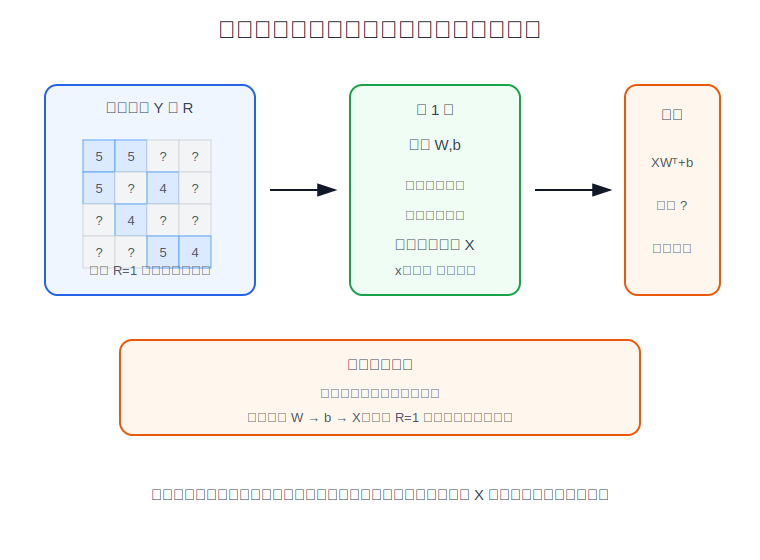
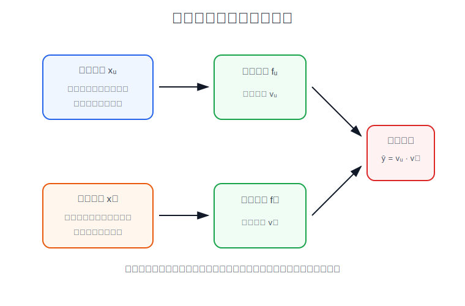
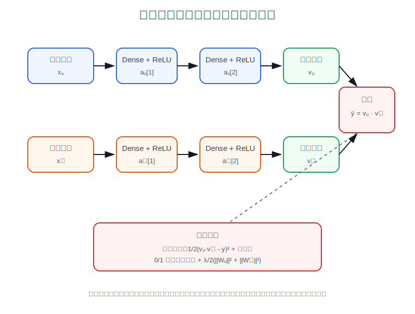

# 推荐系统

推荐系统用于从大量候选物品中为用户选出更相关的物品。课程中先从评分预测开始讲协同过滤，再扩展到二元标签、均值归一化、相关物品查找、基于内容的深度学习推荐，以及大规模候选集的检索和排序。

## 1. 推荐系统问题

设共有 $n_m$ 个物品和 $n_u$ 个用户。评分矩阵 $Y$ 中的元素 $y^{(i,j)}$ 表示用户 $j$ 对物品 $i$ 的评分：

$$
y^{(i,j)}
=
\text{rating from user }j\text{ on item }i
$$

并不是每个用户都会给每个物品评分，因此需要额外定义指示矩阵 $R$：

$$
r^{(i,j)}
=
\begin{cases}
1, & \text{user }j\text{ rated item }i\\
0, & \text{user }j\text{ did not rate item }i
\end{cases}
$$

推荐系统的目标是根据已有评分预测未评分位置的 $\hat{y}^{(i,j)}$，再把预测评分较高且用户尚未看过的物品推荐给用户。

下面使用同一组电影评分数据贯穿本篇笔记。行表示电影，列表示用户，`?` 表示用户没有评分：

| 电影 | 用户 1 | 用户 2 | 用户 3 | 用户 4 |
| --- | ---: | ---: | ---: | ---: |
| 电影 1：爱情片 | 5 | 5 | ? | ? |
| 电影 2：爱情 / 动作 | 5 | ? | 4 | ? |
| 电影 3：爱情片 | ? | 4 | ? | ? |
| 电影 4：动作片 | ? | ? | 5 | 4 |
| 电影 5：动作片 | ? | ? | 4 | 5 |

对应的评分矩阵和指示矩阵为：

$$
Y=
\begin{bmatrix}
5 & 5 & ? & ?\\
5 & ? & 4 & ?\\
? & 4 & ? & ?\\
? & ? & 5 & 4\\
? & ? & 4 & 5
\end{bmatrix}
$$

$$
R=
\begin{bmatrix}
1 & 1 & 0 & 0\\
1 & 0 & 1 & 0\\
0 & 1 & 0 & 0\\
0 & 0 & 1 & 1\\
0 & 0 & 1 & 1
\end{bmatrix}
$$

## 2. 使用物品特征预测评分

这一节的前提是：物品特征 $\mathbf{x}^{(i)}$ 已知，只学习每个用户的参数 $\mathbf{w}^{(j)}$ 和偏置 $b^{(j)}$。在这个前提下，用户 $j$ 对物品 $i$ 的预测评分为：

$$
\hat{y}^{(i,j)}
=
\mathbf{w}^{(j)}\cdot\mathbf{x}^{(i)}
+
b^{(j)}
$$

只在用户已经评分的位置计算误差，单个用户的代价函数为：

$$
J(\mathbf{w}^{(j)},b^{(j)})
=
\frac{1}{2}
\sum_{i:r^{(i,j)}=1}
\left(
\mathbf{w}^{(j)}\cdot\mathbf{x}^{(i)}
+
b^{(j)}
-
y^{(i,j)}
\right)^2
+
\frac{\lambda}{2}
\sum_{k=1}^{n} \left(w_k^{(j)}\right)^2
$$

这一步的形式和线性回归相同，因为它是在“特征已知、评分作为标签”的条件下为每个用户拟合一个评分预测模型。它不是协同过滤的完整形式，而是课程用来引出协同过滤的第一步。

这种做法要求物品特征事先存在。例如电影推荐中，特征可以表示爱情片程度、动作片程度、喜剧程度等；用户参数表示用户对这些特征的偏好。

## 3. 协同过滤

上一节固定物品特征 $\mathbf{x}^{(i)}$，学习用户参数 $\mathbf{w}^{(j)},b^{(j)}$。课程接着反过来说明：如果用户参数 $\mathbf{w}^{(j)},b^{(j)}$ 已知，也可以根据这些用户的评分学习某个物品的特征 $\mathbf{x}^{(i)}$。

固定 $\mathbf{w}^{(j)},b^{(j)}$ 时，单个物品 $i$ 的代价函数为：

$$
J(\mathbf{x}^{(i)})
=
\frac{1}{2}
\sum_{j:r^{(i,j)}=1}
\left(
\mathbf{w}^{(j)}\cdot\mathbf{x}^{(i)}
+
b^{(j)}
-
y^{(i,j)}
\right)^2
+
\frac{\lambda}{2}
\sum_{k=1}^{n}\left(x_k^{(i)}\right)^2
$$

这一步突出的是“根据已知用户偏好反推物品特征”。协同过滤把这两个方向合在一起：既学习所有物品特征 $\mathbf{x}^{(i)}$，也学习所有用户参数 $\mathbf{w}^{(j)},b^{(j)}$。它利用的是用户之间、物品之间的共同评分模式。



协同过滤的整体代价函数为：

$$
J(\mathbf{X},\mathbf{W},\mathbf{b})
=
\frac{1}{2}
\sum_{(i,j):r^{(i,j)}=1}
\left(
\mathbf{w}^{(j)}\cdot\mathbf{x}^{(i)}
+
b^{(j)}
-
y^{(i,j)}
\right)^2
+
\frac{\lambda}{2}
\sum_{i=1}^{n_m}
\sum_{k=1}^{n}
\left(x_k^{(i)}\right)^2
+
\frac{\lambda}{2}
\sum_{j=1}^{n_u}
\sum_{k=1}^{n}
\left(w_k^{(j)}\right)^2
$$

矩阵形式下，预测评分可以写成：

$$
\hat{\mathbf{Y}}
=
\mathbf{X}\mathbf{W}^{T}
+
\mathbf{b}
$$

其中 $\mathbf{X}\in\mathbb{R}^{n_m\times n}$，$\mathbf{W}\in\mathbb{R}^{n_u\times n}$，$\mathbf{b}\in\mathbb{R}^{1\times n_u}$。训练时只对 $R=1$ 的位置计算误差。

课程中的梯度下降同时更新三类参数：用户参数 $\mathbf{w}^{(j)}$、用户偏置 $b^{(j)}$ 和物品特征 $\mathbf{x}^{(i)}$。对任意已评分位置，先定义预测误差：

$$
e^{(i,j)}
=
\mathbf{w}^{(j)}\cdot\mathbf{x}^{(i)}
+
b^{(j)}
-
y^{(i,j)}
$$

则更新顺序可以写成：

$$
w_k^{(j)}
:=
w_k^{(j)}
-
\alpha
\left(
\sum_{i:r^{(i,j)}=1}
e^{(i,j)}x_k^{(i)}
+
\lambda w_k^{(j)}
\right)
$$

$$
b^{(j)}
:=
b^{(j)}
-
\alpha
\sum_{i:r^{(i,j)}=1}
e^{(i,j)}
$$

$$
x_k^{(i)}
:=
x_k^{(i)}
-
\alpha
\left(
\sum_{j:r^{(i,j)}=1}
e^{(i,j)}w_k^{(j)}
+
\lambda x_k^{(i)}
\right)
$$

实现时不是先把所有 $w,b$ 训练完再训练 $x$，而是在每一轮迭代中根据当前误差计算三组梯度，再更新 $\mathbf{W}$、$\mathbf{b}$ 和 $\mathbf{X}$。

在上面的评分矩阵中，用户 1 和用户 2 都给爱情片高分，用户 3 和用户 4 都给动作片高分。协同过滤会从这些共同评分模式中自动学习出类似“爱情程度”和“动作程度”的隐藏特征，而不是要求人工先给每部电影打标签。

## 4. 二元标签推荐

评分预测使用连续标签，例如 $1$ 到 $5$ 星。点击、收藏、购买等行为更适合建模为二元标签：

$$
y^{(i,j)}
=
\begin{cases}
1, & \text{user }j\text{ engaged with item }i\\
0, & \text{user }j\text{ did not engage with item }i
\end{cases}
$$

此时模型输出用户对物品产生行为的概率：

$$
P\left(y^{(i,j)}=1\mid\mathbf{x}^{(i)},\mathbf{w}^{(j)},b^{(j)}\right)
=
g\left(
\mathbf{w}^{(j)}\cdot\mathbf{x}^{(i)}
+
b^{(j)}
\right)
$$

其中 $g(z)$ 是 Sigmoid 函数。代价函数从平方误差换成交叉熵损失。

对一个已观测的用户-物品对，逻辑回归损失为：

$$
\mathcal{L}\left(f_{\mathbf{w},b,\mathbf{x}}(i,j),y^{(i,j)}\right)
=
-
y^{(i,j)}
\log f_{\mathbf{w},b,\mathbf{x}}(i,j)
-
\left(1-y^{(i,j)}\right)
\log
\left(1-f_{\mathbf{w},b,\mathbf{x}}(i,j)\right)
$$

其中：

$$
f_{\mathbf{w},b,\mathbf{x}}(i,j)
=
g\left(
\mathbf{w}^{(j)}\cdot\mathbf{x}^{(i)}
+
b^{(j)}
\right)
$$

二元标签下的协同过滤目标函数为：

$$
J(\mathbf{X},\mathbf{W},\mathbf{b})
=
\sum_{(i,j):r^{(i,j)}=1}
\mathcal{L}\left(f_{\mathbf{w},b,\mathbf{x}}(i,j),y^{(i,j)}\right)
+
\frac{\lambda}{2}
\sum_{i=1}^{n_m}
\sum_{k=1}^{n}
\left(x_k^{(i)}\right)^2
+
\frac{\lambda}{2}
\sum_{j=1}^{n_u}
\sum_{k=1}^{n}
\left(w_k^{(j)}\right)^2
$$

梯度下降仍然更新 $\mathbf{W}$、$\mathbf{b}$ 和 $\mathbf{X}$。令：

$$
e^{(i,j)}
=
f_{\mathbf{w},b,\mathbf{x}}(i,j)
-
y^{(i,j)}
$$

则更新形式与逻辑回归一致，只是这里的物品特征 $\mathbf{x}^{(i)}$ 也要一起学习：

$$
w_k^{(j)}
:=
w_k^{(j)}
-
\alpha
\left(
\sum_{i:r^{(i,j)}=1}
e^{(i,j)}x_k^{(i)}
+
\lambda w_k^{(j)}
\right)
$$

$$
b^{(j)}
:=
b^{(j)}
-
\alpha
\sum_{i:r^{(i,j)}=1}
e^{(i,j)}
$$

$$
x_k^{(i)}
:=
x_k^{(i)}
-
\alpha
\left(
\sum_{j:r^{(i,j)}=1}
e^{(i,j)}w_k^{(j)}
+
\lambda x_k^{(i)}
\right)
$$

同一份电影数据如果不记录 $1$ 到 $5$ 星评分，而只记录“用户是否点击 / 收藏 / 看完”，就可以把已发生行为记为 $1$，未发生行为记为 $0$。此时模型不再预测评分数值，而是预测用户对电影产生行为的概率。

## 5. 均值归一化

均值归一化的核心作用是：用已有数据的均值来初始化未知用户的数据。

对每个物品 $i$，先计算已评分用户的平均分：

$$
\mu_i
=
\frac{
\sum_{j:r^{(i,j)}=1}
y^{(i,j)}
}{
\sum_{j=1}^{n_u}r^{(i,j)}
}
$$

以上面的评分矩阵为例：

$$
Y=
\begin{bmatrix}
5 & 5 & ? & ?\\
5 & ? & 4 & ?\\
? & 4 & ? & ?\\
? & ? & 5 & 4\\
? & ? & 4 & 5
\end{bmatrix}
$$

每一行是一部电影。只对已评分位置求平均，得到：

$$
\boldsymbol{\mu}
=
\begin{bmatrix}
5\\
4.5\\
4\\
4.5\\
4.5
\end{bmatrix}
$$

其中电影 1 的已知评分为 $5,5$，所以 $\mu_1=5$；电影 2 的已知评分为 $5,4$，所以 $\mu_2=4.5$；电影 4 的已知评分为 $5,4$，所以 $\mu_4=4.5$。

再把评分矩阵中心化：

$$
y_{\text{norm}}^{(i,j)}
=
y^{(i,j)}-\mu_i
$$

得到归一化后的评分矩阵：

$$
Y_{\text{norm}}
=
\begin{bmatrix}
0 & 0 & ? & ?\\
0.5 & ? & -0.5 & ?\\
? & 0 & ? & ?\\
? & ? & 0.5 & -0.5\\
? & ? & -0.5 & 0.5
\end{bmatrix}
$$

模型训练时拟合 $y_{\text{norm}}^{(i,j)}$，预测时再加回物品均值：

$$
\hat{y}^{(i,j)}
=
\mathbf{w}^{(j)}\cdot\mathbf{x}^{(i)}
+
b^{(j)}
+
\mu_i
$$

例如模型对电影 2、用户 4 的归一化预测为 $0.3$，则最终评分为：

$$
\hat{y}^{(2,4)}
=
0.3+\mu_2
=
0.3+4.5
=
4.8
$$

如果新增一个没有任何历史评分的用户，模型没有该用户偏好信息时，预测值会回到这些电影均值附近。

## 6. 查找相关物品

协同过滤学到的 $\mathbf{x}^{(i)}$ 是物品的低维表示。两个物品的表示越接近，说明它们在用户评分模式中越相似。可以用平方距离查找相关物品：

$$
\left\|
\mathbf{x}^{(i)}-\mathbf{x}^{(k)}
\right\|^2
$$

距离越小，物品 $i$ 和物品 $k$ 越相关。这种相关性来自用户评分数据，不依赖人工编写的类别标签。

在上面的例子中，电影 4 和电影 5 都被用户 3、用户 4 给高分，训练后它们的向量距离会更小；电影 1 和电影 3 都更接近爱情片用户的偏好，它们也会成为相关物品。

## 7. 基于内容的推荐

协同过滤主要依赖用户和物品的交互记录。基于内容的推荐还会使用用户特征和物品特征，例如用户年龄、地区、浏览历史，电影类型、年份、演员等。

这里走的是基于内容的双塔神经网络，不是前面的线性回归，也不是协同过滤矩阵分解。区别是：

| 方法 | 输入 | 学到的内容 | 打分方式 |
| --- | --- | --- | --- |
| 已知物品特征的线性回归 | 人工物品特征 $\mathbf{x}^{(i)}$ | 每个用户的 $\mathbf{w}^{(j)},b^{(j)}$ | $\mathbf{w}^{(j)}\cdot\mathbf{x}^{(i)}+b^{(j)}$ |
| 协同过滤 | 评分矩阵 $Y,R$ | 物品向量 $\mathbf{x}^{(i)}$ 和用户向量 $\mathbf{w}^{(j)}$ | $\mathbf{w}^{(j)}\cdot\mathbf{x}^{(i)}+b^{(j)}$ |
| 基于内容的双塔网络 | 用户特征 $\mathbf{x}_u$ 和物品特征 $\mathbf{x}_m$ | 两个神经网络 $f_u,f_m$ 的参数 | $\mathbf{v}_u\cdot\mathbf{v}_m$ |

课程中的做法是分别构造用户网络和物品网络，把用户特征和物品特征映射到同一维度的向量空间：





$$
\mathbf{v}_u
=
f_u(\mathbf{x}_u)
$$

$$
\mathbf{v}_m
=
f_m(\mathbf{x}_m)
$$

其中 $f_u$ 和 $f_m$ 是两个神经网络。$f_u$ 接收用户特征，输出用户向量 $\mathbf{v}_u$；$f_m$ 接收物品特征，输出物品向量 $\mathbf{v}_m$。这两个向量的维度必须相同，否则不能做点积。

用户塔可以写成：

$$
\mathbf{a}_u^{[1]}
=
g\left(
\mathbf{W}_u^{[1]}\mathbf{x}_u+\mathbf{b}_u^{[1]}
\right)
$$

$$
\mathbf{a}_u^{[2]}
=
g\left(
\mathbf{W}_u^{[2]}\mathbf{a}_u^{[1]}+\mathbf{b}_u^{[2]}
\right)
$$

$$
\mathbf{v}_u
=
\mathbf{W}_u^{[3]}\mathbf{a}_u^{[2]}+\mathbf{b}_u^{[3]}
$$

物品塔使用另一组参数：

$$
\mathbf{a}_m^{[1]}
=
g\left(
\mathbf{W}_m^{[1]}\mathbf{x}_m+\mathbf{b}_m^{[1]}
\right)
$$

$$
\mathbf{a}_m^{[2]}
=
g\left(
\mathbf{W}_m^{[2]}\mathbf{a}_m^{[1]}+\mathbf{b}_m^{[2]}
\right)
$$

$$
\mathbf{v}_m
=
\mathbf{W}_m^{[3]}\mathbf{a}_m^{[2]}+\mathbf{b}_m^{[3]}
$$

课程中还会对输出向量做长度归一化，让点积更接近余弦相似度：

$$
\mathbf{v}_u
:=
\frac{\mathbf{v}_u}{\left\|\mathbf{v}_u\right\|}
$$

$$
\mathbf{v}_m
:=
\frac{\mathbf{v}_m}{\left\|\mathbf{v}_m\right\|}
$$

预测用户对物品的匹配程度时，使用两个向量的点积：

$$
\hat{y}
=
\mathbf{v}_u\cdot\mathbf{v}_m
$$

如果训练标签是评分，可以用平方误差训练：

$$
J
=
\sum_{(\mathbf{x}_u,\mathbf{x}_m,y)}
\frac{1}{2}
\left(
\mathbf{v}_u\cdot\mathbf{v}_m
-
y
\right)^2
+
\frac{\lambda}{2}
\left(
\sum_l
\left\|\mathbf{W}_u^{[l]}\right\|_F^2
+
\sum_l
\left\|\mathbf{W}_m^{[l]}\right\|_F^2
\right)
$$

其中 $\mathbf{W}_u^{[l]}$ 是用户塔第 $l$ 层的权重矩阵，$\mathbf{W}_m^{[l]}$ 是物品塔第 $l$ 层的权重矩阵，$\|\cdot\|_F^2$ 表示矩阵中全部元素平方和。正则化项约束两座塔的权重大小，用来降低过拟合；偏置项通常不加入正则化。

如果训练标签是点击、收藏、购买等 $0/1$ 行为，可以先把点积送入 Sigmoid，再用逻辑回归损失训练：

$$
P(y=1\mid \mathbf{x}_u,\mathbf{x}_m)
=
g\left(\mathbf{v}_u\cdot\mathbf{v}_m\right)
$$

对应的整体目标函数为：

$$
J
=
\sum_{(\mathbf{x}_u,\mathbf{x}_m,y)}
\mathcal{L}
\left(
g\left(\mathbf{v}_u\cdot\mathbf{v}_m\right),
y
\right)
+
\frac{\lambda}{2}
\left(
\sum_l
\left\|\mathbf{W}_u^{[l]}\right\|_F^2
+
\sum_l
\left\|\mathbf{W}_m^{[l]}\right\|_F^2
\right)
$$

训练时，样本是一对用户特征和物品特征 $(\mathbf{x}_u,\mathbf{x}_m)$，标签是评分或是否互动。前向传播先分别通过用户塔和物品塔得到 $\mathbf{v}_u,\mathbf{v}_m$，再用点积得到预测值；反向传播会同时更新用户塔参数和物品塔参数。这里不再为每个用户单独保存一个 $\mathbf{w}^{(j)}$，也不再为每个物品单独保存一个协同过滤向量 $\mathbf{x}^{(i)}$，而是用神经网络从原始用户特征和物品特征中计算向量。

## 8. 大规模目录的检索和排序

当候选物品数量很大时，不能对每个用户逐一计算所有物品的精确排序。课程中的工程流程可以拆成两步：

1. 检索：从大目录中快速找出几百个候选物品。
2. 排序：对候选物品使用更复杂的模型打分，并返回前若干个结果。

检索阶段可以使用最近邻搜索、热门物品、同类物品、用户历史相似物品等方法生成候选集。排序阶段再结合用户特征、物品特征和上下文特征进行精排。

## 9. NumPy 协同过滤实现

下面的实现只依赖 NumPy，包含均值归一化、协同过滤代价函数、梯度计算、梯度下降训练和推荐结果生成：

```python
import numpy as np


def cofi_cost(Y_norm, R, X, W, b, lambda_=0.0):
    predictions = X @ W.T + b
    errors = (predictions - Y_norm) * R
    cost = 0.5 * np.sum(errors**2)
    regularization = 0.5 * lambda_ * (np.sum(X**2) + np.sum(W**2))
    return cost + regularization


def cofi_gradient(Y_norm, R, X, W, b, lambda_=0.0):
    predictions = X @ W.T + b
    errors = (predictions - Y_norm) * R
    dX = errors @ W + lambda_ * X
    dW = errors.T @ X + lambda_ * W
    db = np.sum(errors, axis=0, keepdims=True)
    return dX, dW, db


def mean_normalize(Y, R):
    item_sum = np.sum(Y * R, axis=1, keepdims=True)
    item_count = np.sum(R, axis=1, keepdims=True)
    item_mean = item_sum / item_count
    Y_norm = (Y - item_mean) * R
    return Y_norm, item_mean


Y = np.array(
    [
        [5.0, 5.0, 0.0, 0.0],
        [5.0, 0.0, 4.0, 0.0],
        [0.0, 4.0, 0.0, 0.0],
        [0.0, 0.0, 5.0, 4.0],
        [0.0, 0.0, 4.0, 5.0],
    ],
    dtype=np.float64,
)
R = (Y != 0).astype(np.float64)

Y_norm, item_mean = mean_normalize(Y, R)

random_generator = np.random.default_rng(0)
num_movies, num_users = Y.shape
num_features = 2
X = 0.1 * random_generator.normal(size=(num_movies, num_features))
W = 0.1 * random_generator.normal(size=(num_users, num_features))
b = np.zeros((1, num_users))

alpha = 0.01
lambda_ = 0.1
for _ in range(2000):
    dX, dW, db = cofi_gradient(Y_norm, R, X, W, b, lambda_)
    X -= alpha * dX
    W -= alpha * dW
    b -= alpha * db

predictions = X @ W.T + b + item_mean
user_id = 3
unrated = R[:, user_id] == 0
recommended_indices = np.argsort(predictions[unrated, user_id])[::-1]
movie_ids = np.arange(num_movies)[unrated][recommended_indices]

print("最终代价:", round(cofi_cost(Y_norm, R, X, W, b, lambda_), 4))
print("物品均值:", np.round(item_mean.ravel(), 2))
print("用户 4 的预测评分:", np.round(predictions[:, user_id], 2))
print("推荐电影索引:", movie_ids[:2])
```

预期输出：

```text
最终代价: 0.13
物品均值: [5.  4.5 4.  4.5 4.5]
用户 4 的预测评分: [4.9  4.94 4.09 4.05 4.95]
推荐电影索引: [1 0]
```

索引从 $0$ 开始。用户 4 已经给第 3、4 个物品评分，因此推荐列表只从未评分物品中产生。

## 参考资料

- [吴恩达 Machine Learning Specialization：Unsupervised Learning, Recommenders, Reinforcement Learning](https://www.coursera.org/learn/unsupervised-learning-recommenders-reinforcement-learning)
