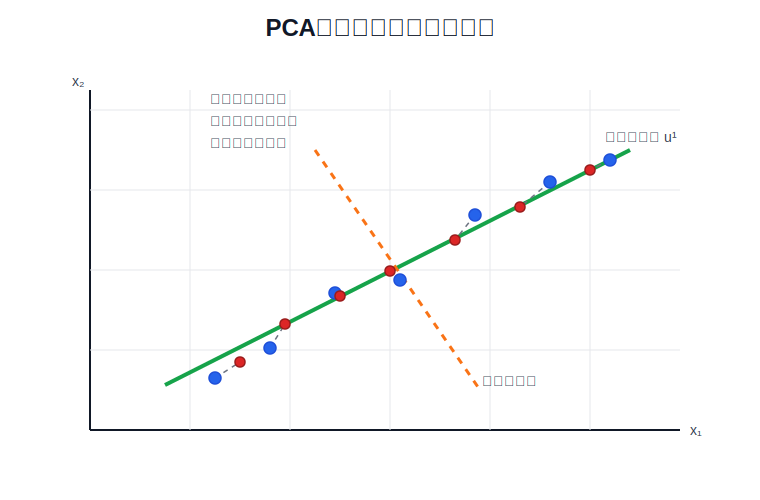
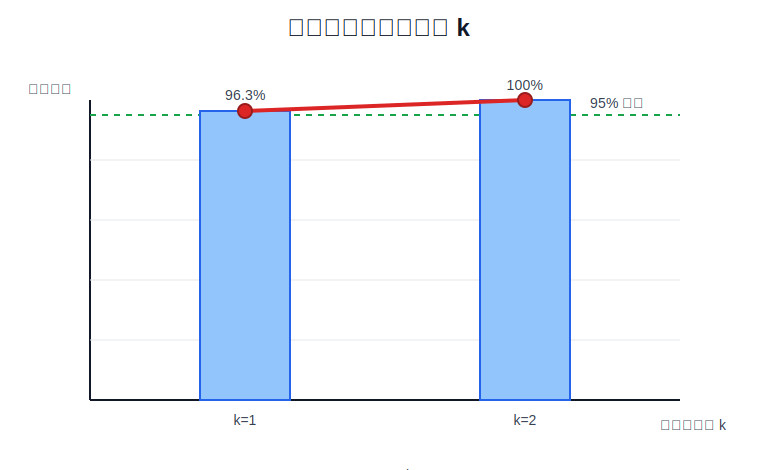

# PCA 主成分分析

PCA（Principal Component Analysis，主成分分析）是一种无监督降维算法。它不使用标签 $y$，只根据输入特征 $\mathbf{x}$ 的分布，找到能保留数据主要变化方向的低维表示。

## 1. 降维问题

设原始样本为：

$$
\mathbf{x}^{(i)}
\in
\mathbb{R}^{n}
$$

PCA 要把它映射到更低维的向量：

$$
\mathbf{z}^{(i)}
\in
\mathbb{R}^{k},
\qquad
k<n
$$

例如把二维数据降到一维，或者把三维数据降到二维。降维后的 $\mathbf{z}^{(i)}$ 保留原始数据中的主要变化方向，同时丢掉变化较小的方向。

PCA 的目标不是预测标签，也不是拟合一条回归直线。线性回归最小化的是预测值和真实标签之间的垂直误差；PCA 最小化的是样本点到低维子空间的投影重建误差。

## 2. 数据预处理

PCA 对特征尺度敏感。若某个特征取值范围很大，它会主导主成分方向。因此执行 PCA 前，需要先做均值归一化；当不同特征量纲不同，还需要特征缩放。

对第 $j$ 个特征：

$$
\mu_j
=
\frac{1}{m}
\sum_{i=1}^{m}
x_j^{(i)}
$$

$$
\sigma_j
=
\sqrt{
\frac{1}{m}
\sum_{i=1}^{m}
\left(x_j^{(i)}-\mu_j\right)^2
}
$$

归一化后的特征为：

$$
x_{j,\text{norm}}^{(i)}
=
\frac{x_j^{(i)}-\mu_j}{\sigma_j}
$$

如果所有特征已经处在同一量纲，只做均值归一化即可；如果特征量纲不同，应同时除以标准差。

## 3. PCA 的几何直觉

PCA 会寻找第一个主成分方向 $\mathbf{u}^{(1)}$，使样本投影到该方向后保留的方差最大。把二维数据降到一维时，所有样本都会投影到同一条直线上。



图中的蓝色点是原始样本，红色点是投影后的低维重建点，灰色线段表示重建误差。PCA 选择的方向让这些灰色线段的平方和最小。

## 4. SVD 求主成分

将所有预处理后的样本组成矩阵 $\mathbf{X}_{\text{norm}}\in\mathbb{R}^{m\times n}$。先计算协方差矩阵：

$$
\Sigma
=
\frac{1}{m}
\mathbf{X}_{\text{norm}}^T
\mathbf{X}_{\text{norm}}
$$

然后对 $\Sigma$ 做奇异值分解：

$$
U,S,V^T
=
\operatorname{svd}(\Sigma)
$$

$U$ 的列向量就是主成分方向：

$$
U=
\begin{bmatrix}
\mathbf{u}^{(1)} &
\mathbf{u}^{(2)} &
\cdots &
\mathbf{u}^{(n)}
\end{bmatrix}
$$

取前 $k$ 个主成分得到：

$$
U_{\text{reduce}}
=
\begin{bmatrix}
\mathbf{u}^{(1)} &
\mathbf{u}^{(2)} &
\cdots &
\mathbf{u}^{(k)}
\end{bmatrix}
\in
\mathbb{R}^{n\times k}
$$

## 5. 投影降维与重建

对单个样本 $\mathbf{x}^{(i)}_{\text{norm}}$，降维表示为：

$$
\mathbf{z}^{(i)}
=
U_{\text{reduce}}^T
\mathbf{x}^{(i)}_{\text{norm}}
$$

若按行存放一批样本，则矩阵形式为：

$$
Z
=
X_{\text{norm}}
U_{\text{reduce}}
$$

从低维表示近似恢复原始归一化特征：

$$
\mathbf{x}_{\text{approx}}^{(i)}
=
U_{\text{reduce}}
\mathbf{z}^{(i)}
$$

矩阵形式为：

$$
X_{\text{approx}}
=
Z
U_{\text{reduce}}^T
$$

重建不是恢复全部原始信息，而是恢复 PCA 保留的主要变化方向。

## 6. 选择主成分数量 k

课程中选择 $k$ 的核心标准是重建误差占总变化量的比例。重建误差为：

$$
\frac{1}{m}
\sum_{i=1}^{m}
\left\|
\mathbf{x}_{\text{norm}}^{(i)}
-
\mathbf{x}_{\text{approx}}^{(i)}
\right\|^2
$$

总变化量为：

$$
\frac{1}{m}
\sum_{i=1}^{m}
\left\|
\mathbf{x}_{\text{norm}}^{(i)}
\right\|^2
$$

如果要求保留 $99\%$ 方差，则需要满足：

$$
\frac{
\frac{1}{m}
\sum_{i=1}^{m}
\left\|
\mathbf{x}_{\text{norm}}^{(i)}
-
\mathbf{x}_{\text{approx}}^{(i)}
\right\|^2
}{
\frac{1}{m}
\sum_{i=1}^{m}
\left\|
\mathbf{x}_{\text{norm}}^{(i)}
\right\|^2
}
\le
0.01
$$

用 SVD 的奇异值可以更直接地计算保留方差比例：

$$
\text{retained variance}
=
\frac{
\sum_{i=1}^{k}S_i
}{
\sum_{i=1}^{n}S_i
}
$$

选择最小的 $k$，使该比例达到目标阈值。



图中第一个主成分已经保留超过 $95\%$ 的方差，因此在该示例中选择 $k=1$ 即可。

## 7. PCA 的使用边界

PCA 适合用于数据压缩和可视化。例如把高维数据压缩为低维表示，或把高维样本降到二维、三维后画图观察结构。

PCA 不应用来替代正则化解决过拟合。过拟合问题应优先使用更多数据、正则化、模型选择和交叉验证处理。PCA 会丢失信息，如果仅为了降低训练误差而使用 PCA，会让模型诊断变得不清晰。

如果训练集、验证集和测试集都要使用 PCA，必须只在训练集上学习 $\mu_j$、$\sigma_j$ 和 $U_{\text{reduce}}$，再把同一组参数应用到验证集和测试集，不能分别对不同数据集重新拟合 PCA。

## 8. NumPy 完整实现

下面的实现只依赖 NumPy，包含数据预处理、协方差矩阵、SVD、选择 $k$、投影、重建和重建误差计算：

```python
import numpy as np


def fit_pca(X):
    mu = np.mean(X, axis=0)
    sigma = np.std(X, axis=0)
    if np.any(sigma == 0):
        raise ValueError("每个特征的标准差必须大于 0")

    X_norm = (X - mu) / sigma
    covariance = X_norm.T @ X_norm / X_norm.shape[0]
    U, singular_values, _ = np.linalg.svd(covariance)
    return mu, sigma, U, singular_values, X_norm


def project_data(X_norm, U, k):
    U_reduce = U[:, :k]
    return X_norm @ U_reduce


def recover_data(Z, U, k):
    U_reduce = U[:, :k]
    return Z @ U_reduce.T


def choose_k(singular_values, retained_variance=0.99):
    cumulative = np.cumsum(singular_values) / np.sum(singular_values)
    return int(np.searchsorted(cumulative, retained_variance) + 1), cumulative


X = np.array(
    [
        [2.5, 2.4],
        [0.5, 0.7],
        [2.2, 2.9],
        [1.9, 2.2],
        [3.1, 3.0],
        [2.3, 2.7],
        [2.0, 1.6],
        [1.0, 1.1],
        [1.5, 1.6],
        [1.1, 0.9],
    ],
    dtype=np.float64,
)

mu, sigma, U, singular_values, X_norm = fit_pca(X)
k, cumulative = choose_k(singular_values, retained_variance=0.95)
Z = project_data(X_norm, U, k)
X_approx_norm = recover_data(Z, U, k)
X_approx = X_approx_norm * sigma + mu

reconstruction_error = np.mean(np.sum((X_norm - X_approx_norm) ** 2, axis=1))
total_variation = np.mean(np.sum(X_norm**2, axis=1))
error_ratio = reconstruction_error / total_variation

print("均值:", np.round(mu, 3))
print("标准差:", np.round(sigma, 3))
print("奇异值:", np.round(singular_values, 4))
print("累计保留方差:", np.round(cumulative, 4))
print("选择的 k:", k)
print("降维后前 3 个样本:")
print(np.round(Z[:3], 4))
print("重建误差比例:", round(error_ratio, 4))
print("第 1 个样本重建:", np.round(X_approx[0], 3))
```

预期输出：

```text
均值: [1.81 1.91]
标准差: [0.745 0.803]
奇异值: [1.9259 0.0741]
累计保留方差: [0.963 1.   ]
选择的 k: 1
降维后前 3 个样本:
[[-1.0864]
 [ 2.3089]
 [-1.2419]]
重建误差比例: 0.037
第 1 个样本重建: [2.382 2.527]
```

## 参考资料

- [吴恩达 Machine Learning：Dimensionality Reduction / Principal Component Analysis](https://www.coursera.org/learn/machine-learning)
